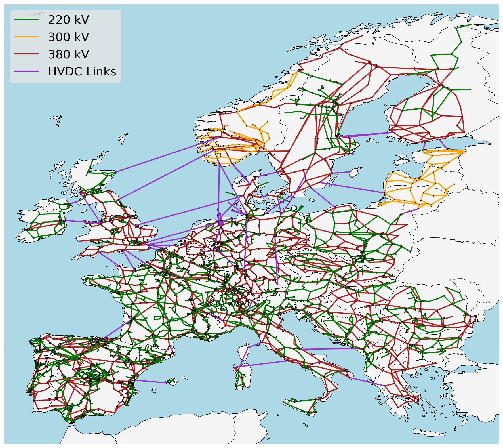
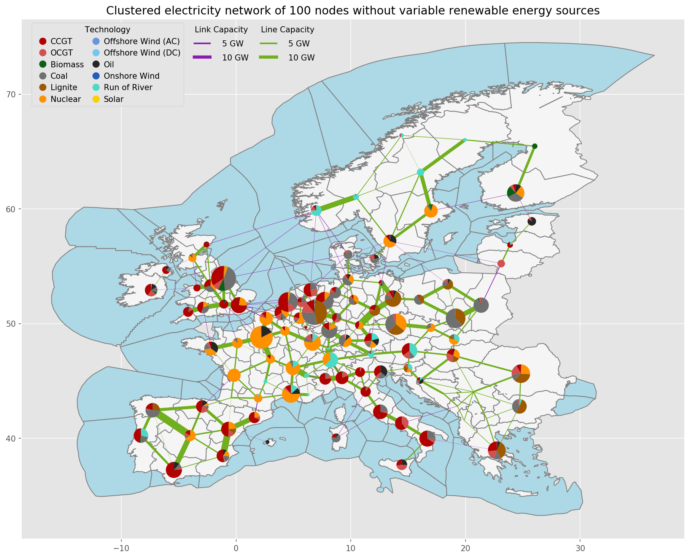

<!--
SPDX-FileCopyrightText: 2017-2020 The PyPSA-Eur Authors
SPDX-License-Identifier: CC-BY-4.0
-->

# PyPSA-Eur: An Open Optimisation Model of the European Transmission System

PyPSA-Eur is an open model dataset of the European power system at the
transmission network level that covers the full ENTSO-E area.
The model is suitable both for operational studies and generation and transmission expansion planning studies.
The continental scope and highly resolved spatial scale enables a proper description of the long-range
smoothing effects for renewable power generation and their varying resource availability.

The model is described in the [documentation](https://pypsa-eur.readthedocs.io)
and in the paper
[PyPSA-Eur: An Open Optimisation Model of the European Transmission
System](https://arxiv.org/abs/1806.01613), 2018,
[arXiv:1806.01613](https://arxiv.org/abs/1806.01613).

**WARNING**: Please read the [limitations](https://pypsa-eur.readthedocs.io/en/latest/limitations.html) section of the
documentation and paper carefully before using the model. We do not
recommend to use the full resolution network model for simulations. At
high granularity the assignment of loads and generators to the nearest
network node may not be a correct assumption, depending on the topology of the underlying distribution grid,
and local grid
bottlenecks may cause unrealistic load-shedding or generator
curtailment. We recommend to cluster the network to a couple of
hundred nodes to remove these local inconsistencies. See the
discussion in Section 3.4 "Model validation" of the paper.

The model building routines are defined through a snakemake workflow. The model is designed to be imported into the open toolbox
[PyPSA](https://github.com/PyPSA/PyPSA) for operational studies as
well as generation and transmission expansion planning studies.

The dataset consists of:

- A grid model based on a modified [GridKit](https://github.com/bdw/GridKit)
  extraction of the [ENTSO-E Transmission System
  Map](https://www.entsoe.eu/data/map/). The grid model contains 6001 lines
  (alternating current lines at and above 220kV voltage level and all high
  voltage direct current lines) and 3657 substations.
- The open power plant database
  [powerplantmatching](https://github.com/FRESNA/powerplantmatching).
- Electrical demand time series from the
  [OPSD project](https://open-power-system-data.org/).
- Renewable time series based on ERA5 and SARAH, assembled using the [atlite tool](https://github.com/FRESNA/atlite).
- Geographical potentials for wind and solar generators based on land use (CORINE) and excluding nature reserves (Natura2000) are computed with the [vresutils library](https://github.com/FRESNA/vresutils) and the [glaes library](https://github.com/FZJ-IEK3-VSA/glaes).

Already-built versions of the model can be found in the accompanying [Zenodo
repository](https://doi.org/10.5281/zenodo.3601881).

A version of the model that adds building heating, transport and
industry sectors to the model, as well as gas networks, can be found
in the [PyPSA-Eur-Sec](https://github.com/PyPSA/pypsa-eur-sec) repository.
