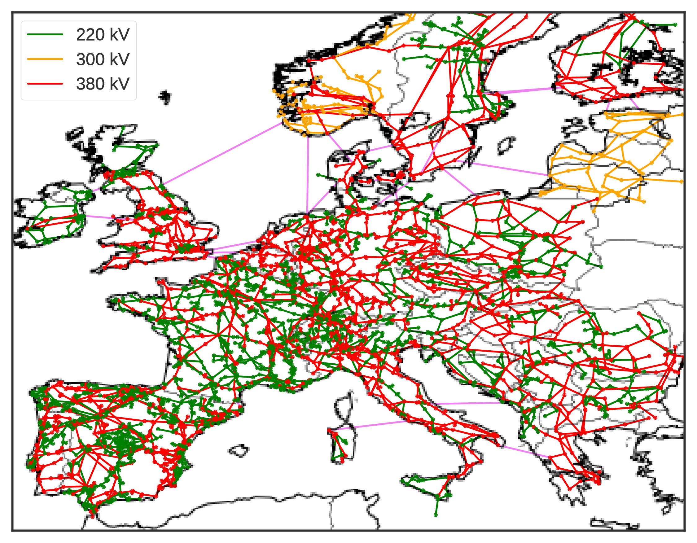

# PyPSA-Eur: An Open Optimisation Model of the European Transmission System

PyPSA-Eur is an open model dataset of the European power system at the
transmission network level that covers the full ENTSO-E area.

The model is described and partially validated in the paper
[PyPSA-Eur: An Open Optimisation Model of the European Transmission
System](https://arxiv.org/abs/1806.01613), 2018,
[arXiv:1806.01613](https://arxiv.org/abs/1806.01613).

This repository contains the scripts and some of the data required to
automatically build the dataset from openly-available sources.

Already-built versions of the model can be found in the accompanying [Zenodo
repository](https://zenodo.org/record/1246851).

The model is designed to be imported into the open toolbox
[PyPSA](https://github.com/PyPSA/PyPSA) for operational studies as
well as generation and transmission expansion planning studies.

The dataset consists of:

- A grid model based on a modified [GridKit](https://github.com/bdw/GridKit)
  extraction of the [ENTSO-E Transmission System
  Map](https://www.entsoe.eu/data/map/). The grid model contains 6001 lines
  (alternating current lines at and above 220kV voltage level and all high
  voltage direct current lines) and 3657 substations.
- The open power plant database
  [powerplantmatching](https://github.com/FRESNA/powerplantmatching).
- Electrical demand time series from the
  [OPSD project](https://open-power-system-data.org/).
- Renewable time series based on ERA5 and SARAH, assembled using the [atlite tool](https://github.com/FRESNA/atlite).
- Geographical potentials for wind and solar generators based on land use (CORINE) and excluding nature reserves (Natura2000) are computed with the [vresutils library](https://github.com/FRESNA/vresutils).
