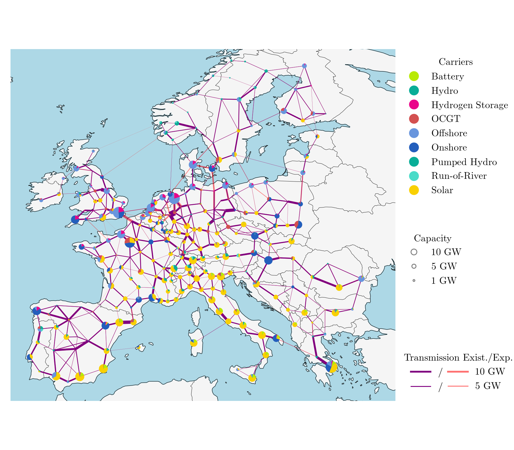
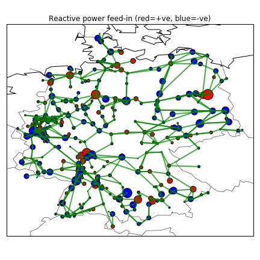

|badge_pypi| |badge_conda| |ci_badge| |ci_badge_conda| |codecov| |badge_docs| |badge_license| |link-latest-doi| |gitter| |binder|

-----

################################
Python for Power System Analysis
################################

.. contents::

.. section-numbering::

About
=====

PyPSA stands for "Python for Power System Analysis". It is pronounced "pipes-ah".

PyPSA is an open source toolbox for
simulating and optimising modern power systems that include features
such as conventional generators with unit commitment, variable wind
and solar generation, storage units, coupling to other energy sectors,
and mixed alternating and direct current networks. PyPSA is designed
to scale well with large networks and long time series.

This project is maintained by the `Energy System Modelling
group <https://www.iai.kit.edu/english/2338.php>`_ at the `Institute for
Automation and Applied
Informatics <https://www.iai.kit.edu/english/index.php>`_ at the
`Karlsruhe Institute of
Technology <http://www.kit.edu/english/index.php>`_. The group is funded by the
`Helmholtz Association <https://www.helmholtz.de/en/>`_ until 2024.
Previous versions were developed by the `Renewable Energy Group
<https://fias.uni-frankfurt.de/physics/schramm/renewable-energy-system-and-network-analysis/>`_
at `FIAS <https://fias.uni-frankfurt.de/>`_ to carry out simulations
for the `CoNDyNet project <http://condynet.de/>`_, financed by the
`German Federal Ministry for Education and Research (BMBF) <https://www.bmbf.de/en/index.html>`_ as part of the `Stromnetze Research Initiative <http://forschung-stromnetze.info/projekte/grundlagen-und-konzepte-fuer-effiziente-dezentrale-stromnetze/>`_.

Documentation
=============

`Documentation <https://pypsa.readthedocs.io/en/latest/index.html>`_

`Quick start <https://pypsa.readthedocs.io/en/latest/quick_start.html>`_

`Examples <http://www.pypsa.org/examples/>`_

`Known users of PyPSA <https://pypsa.readthedocs.io/en/latest/users.html>`_

Documentation is in `sphinx
<http://www.sphinx-doc.org/en/stable/>`_ reStructuredText format in
the ``doc`` sub-folder of the repository.

Functionality
=============

PyPSA can calculate:

* static power flow (using both the full non-linear network equations and
  the linearised network equations)
* linear optimal power flow (least-cost optimisation of power plant
  and storage dispatch within network constraints, using the linear
  network equations, over several snapshots)
* security-constrained linear optimal power flow
* total electricity/energy system least-cost investment optimisation
  (using linear network equations, over several snapshots
  simultaneously for optimisation of generation and storage dispatch
  and investment in the capacities of generation, storage,
  transmission and other infrastructure)

It has models for:

* meshed multiply-connected AC and DC networks, with controllable
  converters between AC and DC networks
* standard types for lines and transformers following the implementation in `pandapower <https://www.pandapower.org/>`_
* conventional dispatchable generators with unit commitment
* generators with time-varying power availability, such as
  wind and solar generators
* storage units with efficiency losses
* simple hydroelectricity with inflow and spillage
* coupling with other energy carriers
* basic components out of which more complicated assets can be built,
  such as Combined Heat and Power (CHP) units, heat pumps, resistive
  Power-to-Heat (P2H), Power-to-Gas (P2G), battery electric vehicles
  (BEVs), Fischer-Tropsch, direct air capture (DAC), etc.; each of
  these is demonstrated in the `examples
  <http://www.pypsa.org/examples/>`_

Other complementary libraries:

* `pandapower <https://www.pandapower.org/>`_ for more
  detailed modelling of distribution grids, short-circuit
  calculations, unbalanced load flow and more
* `PowerDynamics.jl
  <https://github.com/JuliaEnergy/PowerDynamics.jl>`_ for dynamic
  modelling of power grids at time scales where differential equations are relevant

Example scripts as Jupyter notebooks
====================================

There are `extensive examples <http://www.pypsa.org/examples/>`_
available as `Jupyter notebooks <https://jupyter.org/>`_. They are
also described in the `doc/examples.rst <doc/examples.rst>`_ and are
available as Python scripts in `examples/ <examples/>`_.

Screenshots
===========

* `PyPSA-Eur <https://github.com/PyPSA/pypsa-eur>`_ optimising capacities of generation, storage and transmission lines (9% line volume expansion allowed) for a 95% reduction in CO2 emissions in Europe compared to 1990 levels

*  `SciGRID model <https://power.scigrid.de/>`_ simulating the German power system for 2015. Interactive plots also be generated with the `plotly <https://plot.ly/python/>`_ library, as shown in this `Notebook <https://pypsa.org/examples/scigrid-lopf-then-pf-plotly.html>`_

.. image:: doc/img/stacked-gen_and_storage-scigrid.png
    :align: center

.. image:: doc/img/lmp_and_line-loading.png
    :align: right

* Small meshed AC-DC toy model

.. image:: doc/img/ac_dc_meshed.png
    :align: center
    :width: 400px

All results from a PyPSA simulation can be converted into an interactive
online animation using `PyPSA-animation
<https://github.com/PyPSA/PyPSA-animation>`_, for an example see the `PyPSA-Eur-30
example <https://www.pypsa.org/animations/pypsa-eur-30/>`_.

What PyPSA uses under the hood
===============================

PyPSA is written and tested to be compatible with Python 3.6 and
3.7. The last release supporting Python 2.7 was PyPSA 0.15.0.

It leans heavily on the following Python packages:

* `pandas <http://pandas.pydata.org/>`_ for storing data about components and time series
* `numpy <http://www.numpy.org/>`_ and `scipy <http://scipy.org/>`_ for calculations, such as
  linear algebra and sparse matrix calculations
* `pyomo <http://www.pyomo.org/>`_ for preparing optimisation problems (currently only linear)
* `plotly <https://plot.ly/python/>`_ for interactive plotting
* `matplotlib <https://matplotlib.org/>`_ for static plotting
* `cartopy <https://scitools.org.uk/cartopy>`_ for plotting the baselayer map
* `networkx <https://networkx.github.io/>`_ for some network calculations
* `py.test <http://pytest.org/>`_ for unit testing
* `logging <https://docs.python.org/3/library/logging.html>`_ for managing messages

The optimisation uses pyomo so that it is independent of the preferred
solver. You can use e.g. one of the free solvers `GLPK <https://www.gnu.org/software/glpk/>`_
and `CLP/CBC <https://github.com/coin-or/Cbc/>`_ or the commercial
solver `Gurobi <http://www.gurobi.com/>`_
for which free academic licenses are available.

The time-expensive calculations, such as solving sparse linear
equations, are carried out using the `scipy.sparse <https://docs.scipy.org/doc/scipy/reference/sparse.html>`_ libraries.

Mailing list
============

PyPSA has a Google Group `forum / mailing list
<https://groups.google.com/group/pypsa>`_.

Anyone can join and anyone can read the posts; only members of the
group can post to the list.

The intention is to have a place where announcements of new releases
can be made and questions can be asked.

To discuss issues and suggest/contribute features
for future development we prefer ticketing through the `PyPSA Github Issues page
<https://github.com/PyPSA/PyPSA/issues>`_.

Citing PyPSA
============

If you use PyPSA for your research, we would appreciate it if you
would cite the following paper:

* T. Brown, J. Hörsch, D. Schlachtberger, `PyPSA: Python for Power
  System Analysis <https://arxiv.org/abs/1707.09913>`_, 2018,
  `Journal of Open Research Software
  <https://openresearchsoftware.metajnl.com/>`_, 6(1),
  `arXiv:1707.09913 <https://arxiv.org/abs/1707.09913>`_,
  `DOI:10.5334/jors.188 <https://doi.org/10.5334/jors.188>`_

Please use the following BibTeX: ::

   @article{PyPSA,
      author = {T. Brown and J. H\"orsch and D. Schlachtberger},
      title = {{PyPSA: Python for Power System Analysis}},
      journal = {Journal of Open Research Software},
      volume = {6},
      issue = {1},
      number = {4},
      year = {2018},
      eprint = {1707.09913},
      url = {https://doi.org/10.5334/jors.188},
      doi = {10.5334/jors.188}
   }

If you want to cite a specific PyPSA version, each release of PyPSA is
stored on `Zenodo <https://zenodo.org/>`_ with a release-specific DOI.
The release-specific DOIs can be found linked from the overall PyPSA
Zenodo DOI for Version 0.17.1 and onwards:

.. image:: https://zenodo.org/badge/DOI/10.5281/zenodo.3946412.svg
   :target: https://doi.org/10.5281/zenodo.3946412

or from the overall PyPSA Zenodo DOI for Versions up to 0.17.0:

.. image:: https://zenodo.org/badge/DOI/10.5281/zenodo.786605.svg
   :target: https://doi.org/10.5281/zenodo.786605

Licence
=======

Copyright 2015-2021 `PyPSA Developers <https://pypsa.readthedocs.io/en/latest/developers.html>`_

PyPSA is licensed under the open source `MIT License <https://github.com/PyPSA/PyPSA/blob/master/LICENSE.txt>`_.

.. |link-latest-doi| image:: https://zenodo.org/badge/DOI/10.5281/zenodo.3946412.svg
    :target: https://doi.org/10.5281/zenodo.3946412
    :alt: Zenodo

.. |badge_pypi| image:: https://img.shields.io/pypi/v/pypsa.svg
    :target: https://pypi.python.org/pypi/pypsa
    :alt: PyPI version

.. |badge_license| image:: https://img.shields.io/pypi/l/pypsa.svg
    :target: LICENSE.txt
    :alt: License

.. |ci_badge_conda| image:: https://github.com/pypsa/pypsa/actions/workflows/CI-conda.yml/badge.svg
    :target: https://github.com/pypsa/pypsa/actions/workflows/CI-conda.yml
    :alt: CI with conda

.. |ci_badge| image:: https://github.com/pypsa/pypsa/actions/workflows/CI.yml/badge.svg
    :target: https://github.com/pypsa/pypsa/actions/workflows/CI.yml
    :alt: CI

.. |badge_docs| image:: https://readthedocs.org/projects/pypsa/badge/?version=latest
    :target: https://pypsa.readthedocs.io/en/latest/?badge=latest
    :alt: Documentation Status

.. |badge_conda| image:: https://img.shields.io/conda/vn/conda-forge/pypsa.svg
    :target: https://anaconda.org/conda-forge/pypsa
    :alt: Conda version

.. |gitter| image:: https://badges.gitter.im/PyPSA/community.svg
    :target: https://gitter.im/PyPSA/community?utm_source=badge&utm_medium=badge&utm_campaign=pr-badge
    :alt: Chat on Gitter

.. |binder| image:: https://mybinder.org/badge_logo.svg
    :target: https://mybinder.org/v2/gh/PyPSA/PyPSA/master?filepath=examples%2Fnotebooks
    :alt: Examples of use

.. |codecov| image:: https://codecov.io/gh/PyPSA/PyPSA/branch/master/graph/badge.svg?token=kCpwJiV6Jr
    :target: https://codecov.io/gh/PyPSA/PyPSA
    :alt: Code coverage
