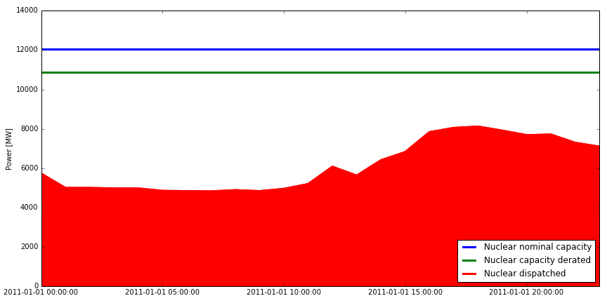

#################
 Components
#################

Power system components can be found in ``pypsa.components.py``.

The attributes of each component can be accessed either from the
objects, e.g. ``bus.v_nom``, or from the pandas DataFrame of all
components, e.g. ``network.buses.v_nom`` for static attributes or
``network.buses_t.p_set`` for time-dependent series attributes.

All attributes are listed below for each component.

Their status is either "Input" for those which the user specifies or
"Output" for those results which PyPSA calculates.

The inputs can be either "required", if the user *must* give the
input, or "optional", if PyPSA will use a sensible default if the user
gives no input.

For functions such as :doc:`power_flow` and :doc:`optimal_power_flow` the inputs used and outputs given are listed in their documentation.

The components and their attributes can also be read from the code in
``pypsa.components.py``.

Network
==========

The ``Network`` is the overall container for all components. It also
has the major functions as methods, such as ``network.lopf()`` and
``network.pf()``.

.. csv-table::
   :header-rows: 1
   :file: network.csv

Sub-Network
=============

Sub-networks are determined by PyPSA and should not be entered by the
user.

Sub-networks are subsets of buses and passive branches (i.e. lines and
transformers) that are connected.

They must have a uniform energy "carrier" inherited from the buses,
such as "DC", "AC", "heat" or "gas". In the case of "AC" sub-networks,
these correspond to synchronous areas. Only "AC" and "DC" sub-networks
can contain passive branches; all other sub-networks must contain a
single isolated bus.

The power flow in sub-networks is determined by the passive flow
through passive branches due to the impedances of the passive branches.

Sub-Network are determined by calling
``network.determine_network_topology()``.

.. csv-table::
   :header-rows: 1
   :file: sub_network.csv

Bus
=======

The bus is the fundamental node of the network, to which components
like loads, generators and transmission lines attach. It enforces
energy conservation for all elements feeding in and out of it
(i.e. like Kirchhoff's Current Law).

.. image:: img/buses.png

.. csv-table::
   :header-rows: 1
   :file: buses.csv

One-Ports: Generators, Storage Units, Loads, Stores, Shunt Impedances
=====================================================================

These components share the property that they all connect to a single
bus.

They have attributes:

.. csv-table::
   :header-rows: 1
   :file: one_ports.csv

Generator
---------

Can have generator.dispatch in ["variable","flexible"], which dictates
how they behave in the OPF.

"flexible" generators can dispatch anywhere between
``gen.p_nom*(gen.p_nom_min_pu_fixed)`` and
``gen.p_nom*(gen.p_nom_max_pu_fixed)`` at all times. The factor
``gen.p_nom_max_pu_fixed`` essentially acts like a de-rating
factor. In the following example ``gen.p_nom_max_pu_fixed = 0.9`` and ``gen.p_nom_min_pu_fixed = 0``. Since ``gen.p_nom`` is 12000 MW, the maximum dispatchable active power is 0.9*12000 MW = 10800 MW.

"variable" generators have a time series ``gen.p_max_pu`` which
dictates the active power availability for each snapshot per unit of the nominal power ``gen.p_nom`` and another
time series ``gen.p_min_pu`` which dictates the minimum dispatch. These time
series can take values between 0 and 1, e.g.

.. image:: img/p_max_pu.png

This time series is then multiplied by ``gen.p_nom`` to get the
available power dispatch, which is the maximum that may be dispatched. The actual dispatch may be below this value, e.g.

.. image:: img/scigrid-curtailment.png

For generators, if :math:`p>0` the generator is supplying active power
to the bus and if :math:`q>0` it is supplying reactive power
(i.e. behaving like a capacitor).

.. csv-table::
   :header-rows: 1
   :file: generators.csv

Storage Unit
------------

Has a time-varying state of charge and various efficiencies.

For storage units, if :math:`p>0` the storage unit is supplying active
power to the bus and if :math:`q>0` it is supplying reactive power
(i.e. behaving like a capacitor).

.. csv-table::
   :header-rows: 1
   :file: storage_units.csv

Store
-----

The Store is a more fundamental component for storing energy only (it
cannot convert between energy carriers). It inherits its energy
carrier from the bus to which it is attached.

The Store, Bus and Link are fundamental components with which one can
build more complicated components (Generators, Storage Units, CHPs,
etc.).

The Store has controls and optimisation on the size of its energy
capacity, but not it's power output; to control the power output, you
must put a link in front of it.

.. csv-table::
   :header-rows: 1
   :file: stores.csv

Load
-----

PQ load.

For loads, if :math:`p>0` the load is consuming active power from the
bus and if :math:`q>0` it is consuming reactive power (i.e. behaving
like an inductor).

.. csv-table::
   :header-rows: 1
   :file: loads.csv

Shunt Impedance
---------------

Has voltage-dependent admittance.

For shunt impedances the power consumption is given by :math:`s_i =
|V_i|^2 y_i^*` so that :math:`p_i + j q_i = |V_i|^2 (g_i
-jb_i)`. However the p and q below are defined directly proportional
to g and b :math:`p = |V|^2g` and :math:`q = |V|^2b`, thus if
:math:`p>0` the shunt impedance is consuming active power from the bus
and if :math:`q>0` it is supplying reactive power (i.e. behaving like
an capacitor).

.. csv-table::
   :header-rows: 1
   :file: shunt_impedances.csv

Passive Branches: Lines, Transformers
=====================================

Have bus0 and bus1 to which they attached; power flow through passive
branches is not directly controllable, but is determined passively by
their impedances and the nodal power imbalances.

Power flow at bus recorded in p0, p1, q0, q1.

.. csv-table::
   :header-rows: 1
   :file: branches.csv

Line
------

A transmission line connected line.bus0 to line.bus1. Can be DC or AC.

To see how the impedances are used in the power flow, see :ref:`branch-model`.

.. csv-table::
   :header-rows: 1
   :file: lines.csv

Transformer
------------

Converts from one AC voltage level to another.

To see how the impedances are used in the power flow, see :ref:`branch-model`.

.. csv-table::
   :header-rows: 1
   :file: transformers.csv

.. _controllable-link:

Controllable Branch: Link
=========================

The ``Link`` is a component introduced in PyPSA 0.5.0 for controllable
directed flows between two buses with arbitrary energy carriers. It
can have an efficiency loss and a marginal cost; for this reason its
default settings allow only for power flow in one direction, from
``bus0`` to ``bus1`` (i.e. ``p_min_pu = 0``). To build a bidirectional
lossless link, set ``efficiency = 1``, ``marginal_cost = 0`` and
``p_min_pu = -1``.

The ``Link`` component can be used for any element with a controllable
power flow: a bidirectional point-to-point HVDC link, a unidirectional
lossy HVDC link, a converter between an AC and a DC network, a heat
pump or resistive heater from an AC/DC bus to a heat bus, etc.

NB: ``Link`` has replaced the ``Converter`` component for linking AC
with DC buses and the ``TransportLink`` component for providing
controllable flows between AC buses. If you want to replace
``Converter`` and ``TransportLink`` components in your old code, use
the ``Link`` with ``efficiency = 1``, ``marginal_cost = 0``,
``p_min_pu = -1``, ``p_max_pu = 1`` and ``p_nom* = s_nom*``.

.. csv-table::
   :header-rows: 1
   :file: links.csv

Carrier
=======

For storing information about energy carriers, e.g. $CO_2$ emissions of gas or coal or wind.

(In versions of PyPSA < 0.6.0, this was called Source.)

.. csv-table::
   :header-rows: 1
   :file: carriers.csv
