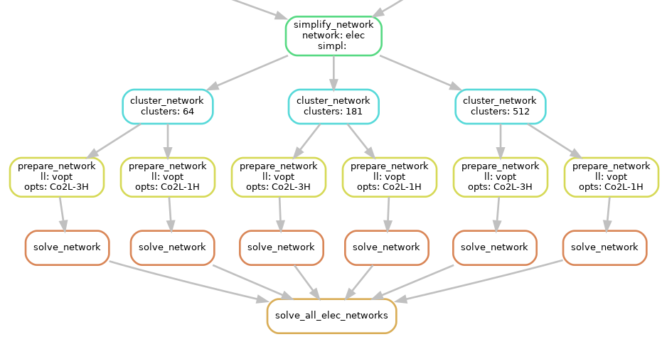

..
  SPDX-FileCopyrightText: 2019-2020 The PyPSA-Eur Authors

  SPDX-License-Identifier: CC-BY-4.0

.. _config:

##########################################
Configuration
##########################################

PyPSA-Eur has several configuration options which are documented in this section and are collected in a ``config.yaml`` file located in the root directory. Users should copy the provided default configuration (``config.default.yaml``) and amend their own modifications and assumptions in the user-specific configuration file (``config.yaml``); confer installation instructions at :ref:`defaultconfig`.

.. _toplevel_cf:

Top-level configuration
=======================

.. literalinclude:: ../config.default.yaml
   :language: yaml
   :lines: 5-12,21,28-34

.. csv-table::
   :header-rows: 1
   :widths: 25,7,22,30
   :file: configtables/toplevel.csv

.. _scenario:

``scenario``
============

It is common conduct to analyse energy system optimisation models for **multiple scenarios** for a variety of reasons,
e.g. assessing their sensitivity towards changing the temporal and/or geographical resolution or investigating how
investment changes as more ambitious greenhouse-gas emission reduction targets are applied.

The ``scenario`` section is an extraordinary section of the config file
that is strongly connected to the :ref:`wildcards` and is designed to
facilitate running multiple scenarios through a single command 

.. code:: bash
    
    snakemake -j 1 solve_all_elec_networks

For each wildcard, a **list of values** is provided. The rule ``solve_all_elec_networks`` will trigger the rules for creating ``results/networks/elec_s{simpl}_{clusters}_ec_l{ll}_{opts}.nc`` for **all combinations** of the provided wildcard values as defined by Python's `itertools.product(...) <https://docs.python.org/2/library/itertools.html#itertools.product>`_ function that snakemake's `expand(...) function <https://snakemake.readthedocs.io/en/stable/snakefiles/rules.html#targets>`_ uses.

An exemplary dependency graph (starting from the simplification rules) then looks like this:

.. literalinclude:: ../config.default.yaml
   :language: yaml
   :lines: 14-19

.. csv-table::
   :header-rows: 1
   :widths: 25,7,22,30
   :file: configtables/scenario.csv

.. _snapshots_cf:

``snapshots``
=============

Specifies the temporal range to build an energy system model for as arguments to `pandas.date_range <https://pandas.pydata.org/pandas-docs/stable/reference/api/pandas.date_range.html>`_

.. literalinclude:: ../config.default.yaml
   :language: yaml
   :lines: 23-26

.. csv-table::
   :header-rows: 1
   :widths: 25,7,22,30
   :file: configtables/snapshots.csv

.. _electricity_cf:

``electricity``
===============

.. literalinclude:: ../config.default.yaml
   :language: yaml
   :lines: 36-54

.. csv-table::
   :header-rows: 1
   :widths: 25,7,22,30
   :file: configtables/electricity.csv

.. warning::
    Carriers in ``conventional_carriers`` must not also be in ``extendable_carriers``.

.. _atlite_cf:

``atlite``
=============

.. literalinclude:: ../config.default.yaml
   :language: yaml
   :lines: 61-74

.. csv-table::
   :header-rows: 1
   :widths: 25,7,22,30
   :file: configtables/atlite.csv

.. _renewable_cf:

``renewable``
=============

``onwind``
----------

.. literalinclude:: ../config.default.yaml
   :language: yaml
   :lines: 76-93

.. csv-table::
   :header-rows: 1
   :widths: 25,7,22,30
   :file: configtables/onwind.csv

``offwind-ac``
--------------

.. literalinclude:: ../config.default.yaml
   :language: yaml
   :lines: 76,94-106

.. csv-table::
   :header-rows: 1
   :widths: 25,7,22,30
   :file: configtables/offwind-ac.csv

``offwind-dc``
---------------

.. literalinclude:: ../config.default.yaml
   :language: yaml
   :lines: 76,107-120

.. csv-table::
   :header-rows: 1
   :widths: 25,7,22,30
   :file: configtables/offwind-dc.csv

``solar``
---------------

.. literalinclude:: ../config.default.yaml
   :language: yaml
   :lines: 76,121-140

.. csv-table::
   :header-rows: 1
   :widths: 25,7,22,30
   :file: configtables/solar.csv

``hydro``
---------------

.. literalinclude:: ../config.default.yaml
   :language: yaml
   :lines: 76,141-147

.. csv-table::
   :header-rows: 1
   :widths: 25,7,22,30
   :file: configtables/hydro.csv

.. _lines_cf:

``lines``
=============

.. literalinclude:: ../config.default.yaml
   :language: yaml
   :lines: 149-157

.. csv-table::
   :header-rows: 1
   :widths: 25,7,22,30
   :file: configtables/lines.csv

.. _links_cf:

``links``
=============

.. literalinclude:: ../config.default.yaml
   :language: yaml
   :lines: 159-163

.. csv-table::
   :header-rows: 1
   :widths: 25,7,22,30
   :file: configtables/links.csv

.. _transformers_cf:

``transformers``
================

.. literalinclude:: ../config.default.yaml
   :language: yaml
   :lines: 165-168

.. csv-table::
   :header-rows: 1
   :widths: 25,7,22,30
   :file: configtables/transformers.csv

.. _load_cf:

``load``
=============

.. literalinclude:: ../config.default.yaml
   :language: yaml
   :lines: 170-174

.. csv-table::
   :header-rows: 1
   :widths: 25,7,22,30
   :file: configtables/load.csv

.. _costs_cf:

``costs``
=============

.. literalinclude:: ../config.default.yaml
   :language: yaml
   :lines: 175-188

.. csv-table::
   :header-rows: 1
   :widths: 25,7,22,30
   :file: configtables/costs.csv

.. note::
    To change cost assumptions in more detail (i.e. other than ``marginal_cost`` and ``capital_cost``), consider modifying cost assumptions directly in ``data/costs.csv`` as this is not yet supported through the config file.

    You can also build multiple different cost databases. Make a renamed copy of ``data/costs.csv`` (e.g. ``data/costs-optimistic.csv``) and set the variable ``COSTS=data/costs-optimistic.csv`` in the ``Snakefile``.

.. _solving_cf:

``solving``
=============

``options``
-----------

.. literalinclude:: ../config.default.yaml
   :language: yaml
   :lines: 190-200

.. csv-table::
   :header-rows: 1
   :widths: 25,7,22,30
   :file: configtables/solving-options.csv

``solver``
----------

.. literalinclude:: ../config.default.yaml
   :language: yaml
   :lines: 190,201-217

.. csv-table::
   :header-rows: 1
   :widths: 25,7,22,30
   :file: configtables/solving-solver.csv

.. _plotting_cf:

``plotting``
=============

.. literalinclude:: ../config.default.yaml
   :language: yaml
   :lines: 219-358

.. csv-table::
   :header-rows: 1
   :widths: 25,7,22,30
   :file: configtables/plotting.csv
