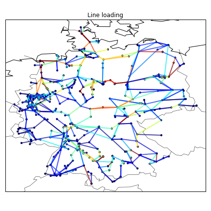
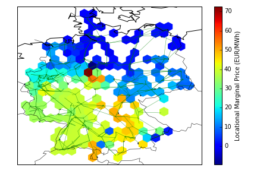
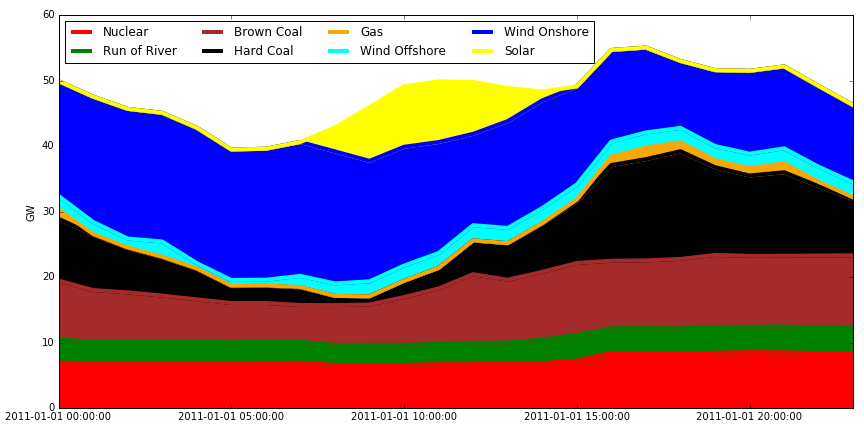
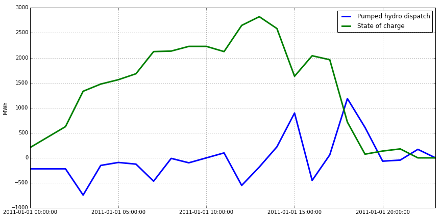
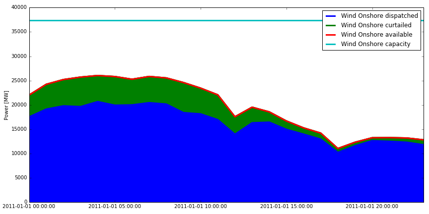
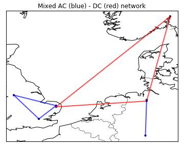
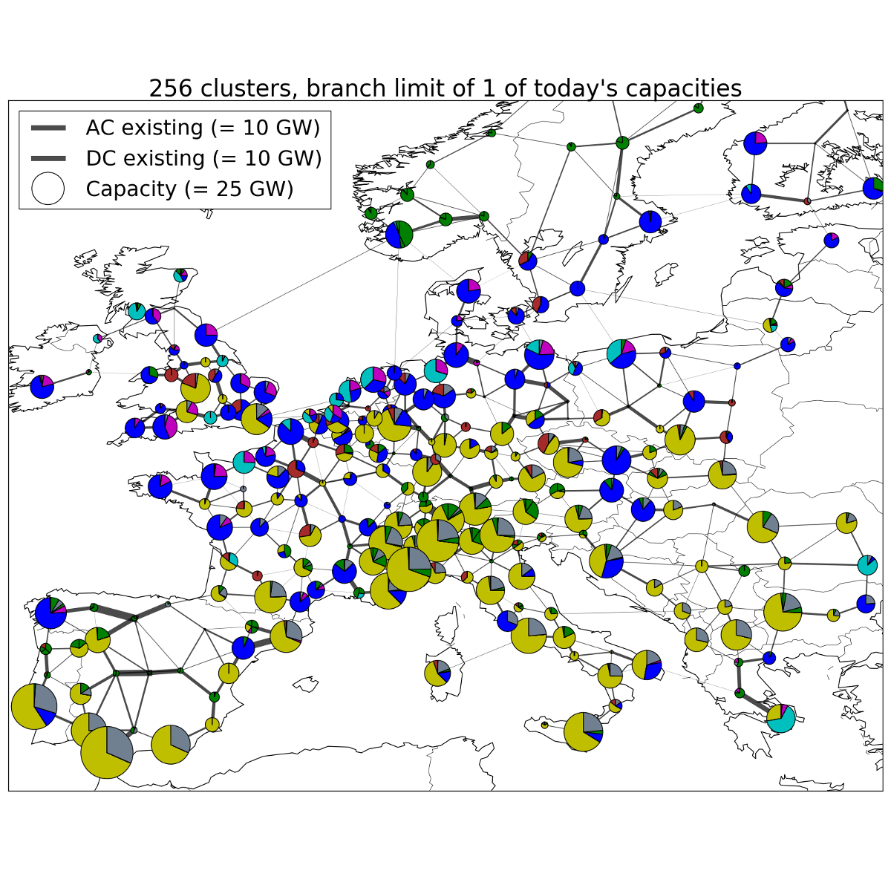

##########################################
 Introduction
##########################################

What PyPSA does and does not do (yet)
=======================================

**PyPSA can calculate:**

* static power flow (using both the full non-linear network equations and
  the linearised network equations)
* linear optimal power flow (least-cost optimisation of power plant and storage
  dispatch within network constraints, using the linear network
  equations, over several snapshots)
* security-constrained linear optimal power flow
* total electricity/energy system least-cost investment optimisation (using linear
  network equations, over several snapshots simultaneously for
  optimisation of generation and storage dispatch and investment in
  the capacities of generation, storage, transmission and other infrastructure)

**It has models for:**

* meshed multiply-connected AC and DC networks, with controllable
  converters between AC and DC networks
* standard types for lines and transformers following the implementation in `pandapower <https://www.uni-kassel.de/eecs/fachgebiete/e2n/software/pandapower.html>`_
* conventional dispatchable generators with unit commitment
* generators with time-varying power availability, such as
  wind and solar generators
* storage units with efficiency losses
* simple hydroelectricity with inflow and spillage
* coupling with other energy carriers
* basic components out of which more complicated assets can be built,
  such as Combined Heat and Power (CHP) units, heat pumps, resistive
  Power-to-Heat (P2H), Power-to-Gas (P2G), battery electric vehicles
  (BEVs), Fischer-Tropsch, direct air capture (DAC), etc.; each of
  these is demonstrated in the `examples
  <http://www.pypsa.org/examples/>`_

**Functionality that may be added in the future:**

* Multi-year investment optimisation
* Distributed active power slack
* Interactive web-based GUI with SVG
* OPF with the full non-linear network equations
* Port to `Julia <http://julialang.org/>`_

**Other complementary libraries:**

* `pandapower <https://github.com/e2nIEE/pandapower>`_ for more
  detailed modelling of distribution grids, short-circuit
  calculations, unbalanced load flow and more
* `PowerDynamics.jl
  <https://github.com/JuliaEnergy/PowerDynamics.jl>`_ for dynamic
  modelling of power grids at time scales where differential equations are relevant

Screenshots
===========

Results from a PyPSA simulation can be converted into an interactive
online animation using `PyPSA-animation
<https://github.com/PyPSA/PyPSA-animation>`_, see the `PyPSA-Eur-30
example <https://www.pypsa.org/animations/pypsa-eur-30/>`_.

Another showcase for PyPSA is the `SciGRID example
<https://pypsa.org/examples/scigrid-lopf-then-pf-plotly.html>`_ which
demonstrates interactive plots generated with the `plotly
<https://plot.ly/python/>`_ library.

.. image:: img/reactive-power.png

Optimised capacities of generation and storage for a 95% reduction in CO2 emissions in Europe compare to 1990 levels:

What PyPSA uses under the hood
===============================

PyPSA is written and tested to be compatible with Python 2.7, 3.6 and 3.7.

It leans heavily on the following Python packages:

* `pandas <http://pandas.pydata.org/>`_ for storing data about components and time series
* `numpy <http://www.numpy.org/>`_ and `scipy <http://scipy.org/>`_ for calculations, such as
  linear algebra and sparse matrix calculations
* `pyomo <http://www.pyomo.org/>`_ for preparing optimisation problems (currently only linear)
* `plotly <https://plot.ly/python/>`_ for interactive plotting
* `matplotlib <https://matplotlib.org/>`_ for static plotting
* `cartopy <https://scitools.org.uk/cartopy>`_ for plotting the baselayer map
* `networkx <https://networkx.github.io/>`_ for some network calculations
* `py.test <http://pytest.org/>`_ for unit testing
* `logging <https://docs.python.org/3/library/logging.html>`_ for managing messages

The optimisation uses pyomo so that it is independent of the preferred
solver. You can use e.g. one of the free solvers `GLPK <https://www.gnu.org/software/glpk/>`_
and `CLP/CBC <https://github.com/coin-or/Cbc/>`_ or the commercial
solver `Gurobi <http://www.gurobi.com/>`_
for which free academic licenses are available.

The time-expensive calculations, such as solving sparse linear
equations, are carried out using the `scipy.sparse <https://docs.scipy.org/doc/scipy/reference/sparse.html>`_ libraries.

Other comparable software
=========================

For a full list see :doc:`comparable_software`.

PyPSA is not as fully featured as other power system simulation tools
such as the Matlab-based free software `PSAT
<http://faraday1.ucd.ie/psat.html>`_ or the commercial package
`DIgSILENT PowerFactory
<http://www.digsilent.de/index.php/products-powerfactory.html>`_.

However for power flow and optimal power flow over several time
snapshots with variable renewable energy sources and/or storage and/or
mixed AC-DC systems, it offers the flexibility of Python and the
transparency of free software.

Another Python power system tool is `PYPOWER
<https://github.com/rwl/PYPOWER/>`_, which is based on the
Matlab-based `MATPOWER <http://www.pserc.cornell.edu//matpower/>`_. In
contrast to PYPOWER, PyPSA has an easier-to-use data model (pandas
DataFrames instead of numpy arrays), support for time-varying data
inputs and support for multiply-connected networks using both AC
and DC. PyPSA uses some of the sparse-matrix constructs from PYPOWER.

