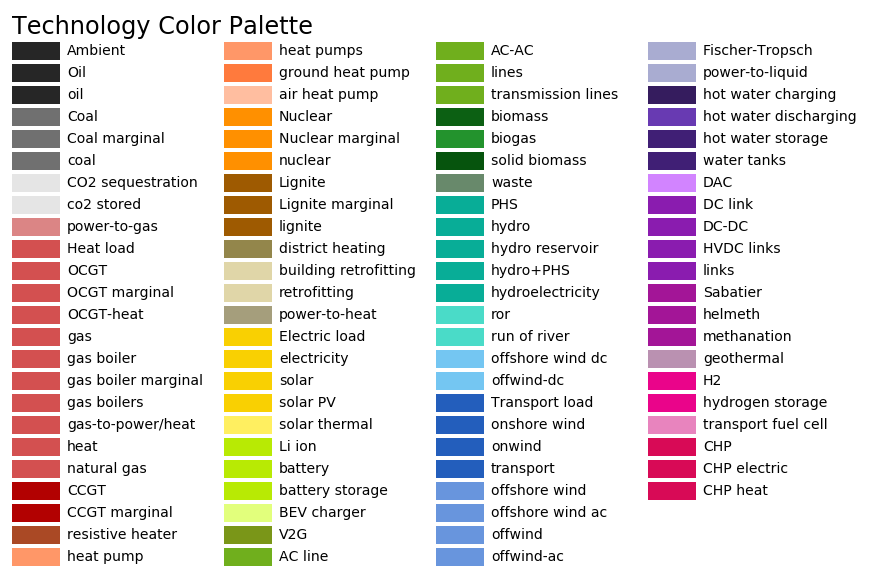

..
  SPDX-FileCopyrightText: 2019-2020 The PyPSA-Eur Authors

  SPDX-License-Identifier: CC-BY-4.0

##########################################
Plotting and Summary
##########################################

.. warning:: The corresponding code is currently under revision and has only minimal documentation.

.. _plot_potentials:

Rule ``plot_p_nom_max``
==========================

.. graphviz::
    :align: center

    digraph snakemake_dag {
        graph [bgcolor=white,
            margin=0,
            size="8,5"
        ];
        node [fontname=sans,
            fontsize=10,
            penwidth=2,
            shape=box,
            style=rounded
        ];
        edge [color=grey,
            penwidth=2
        ];
        0	 [color="0.42 0.6 0.85",
            fillcolor=gray,
            label=plot_p_nom_max,
            style=filled];
        1	 [color="0.58 0.6 0.85",
            label=cluster_network];
        1 -> 0;
    }

|

.. automodule:: plot_p_nom_max

.. _summary:

Rule ``make_summary``
========================

.. graphviz::
    :align: center

    digraph snakemake_dag {
        graph [bgcolor=white,
            margin=0,
            size="8,5"
        ];
        node [fontname=sans,
            fontsize=10,
            penwidth=2,
            shape=box,
            style=rounded
        ];
        edge [color=grey,
            penwidth=2
        ];
        0	 [color="0.47 0.6 0.85",
            fillcolor=gray,
            label=make_summary,
            style=filled];
        1	 [color="0.11 0.6 0.85",
            label=solve_network];
        1 -> 0;
    }

|

.. automodule:: make_summary

.. _summary_plot:

Rule ``plot_summary``
========================

.. .. graphviz::
..     :align: center

|

.. automodule:: plot_summary

.. _map_plot:

Rule ``plot_network``
========================

.. graphviz::
    :align: center

    digraph snakemake_dag {
        graph [bgcolor=white,
            margin=0,
            size="8,5"
        ];
        node [fontname=sans,
            fontsize=10,
            penwidth=2,
            shape=box,
            style=rounded
        ];
        edge [color=grey,
            penwidth=2
        ];
        0	 [color="0.00 0.6 0.85",
            fillcolor=gray,
            label=plot_network,
            style=filled];
        1	 [color="0.50 0.6 0.85",
            label=solve_network];
        1 -> 0;
    }

|

.. automodule:: plot_network

