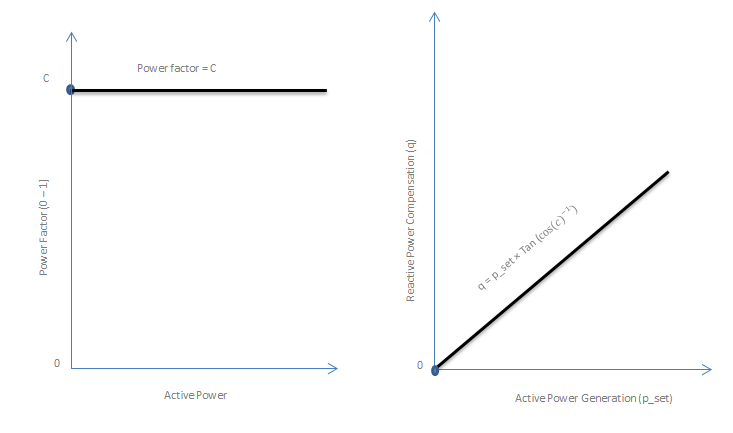
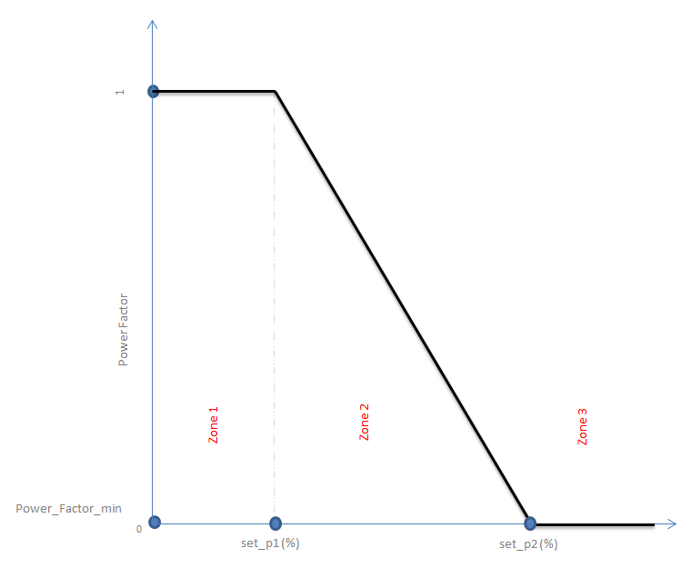
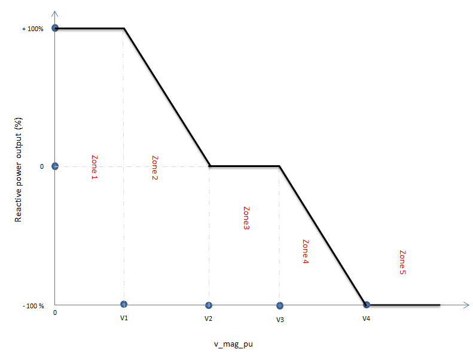

######################
Power Flow
######################

See the module ``pypsa.pf``.

Full non-linear power flow
==========================

The non-linear power flow ``network.pf()`` works for AC networks and
by extension for DC networks too (with a work-around described below).

The non-linear power flow ``network.pf()`` can be called for a
particular ``snapshot`` as ``network.pf(snapshot)`` or on an iterable
of ``snapshots`` as ``network.pf(snapshots)`` to calculate the
non-linear power flow on a selection of snapshots at once (which is
more performant than calling ``network.pf`` on each snapshot
separately). If no argument is passed, it will be called on all
``network.snapshots``.

.. automethod:: pypsa.Network.pf

Non-linear power flow for AC networks
-------------------------------------

The power flow ensures for given inputs (load and power plant
dispatch) that the following equation is satisfied for each bus
:math:`i`:

.. math::
   S_i = P_i + j Q_i = V_i I_i^* = V_i \left(\sum_j Y_{ij} V_j\right)^*

where :math:`V_i = |V_i|e^{j\theta_i}` is the complex voltage, whose
rotating angle is taken relative to the slack bus.

:math:`Y_{ij}` is the bus admittance matrix, based on the branch
impedances and any shunt admittances attached to the buses.

For the slack bus :math:`i=0` it is assumed :math:`|V_0|` is given and that :math:`\theta_0 = 0`; P and Q are to be found.

For the PV buses, P and :math:`|V|` are given; Q and :math:`\theta` are to be found.

For the PQ buses, P and Q are given; :math:`|V|` and :math:`\theta` are to be found.

If PV and PQ are the sets of buses, then there are :math:`|PV| + 2|PQ|` real equations to solve:

.. math::
   \textrm{Re}\left[ V_i \left(\sum_j Y_{ij} V_j\right)^* \right] - P_i & = 0 \hspace{.7cm}\forall\hspace{.1cm} i \in PV \cup PQ \\
   \textrm{Im}\left[ V_i \left(\sum_j Y_{ij} V_j\right)^* \right] - Q_i & = 0 \hspace{.7cm}\forall\hspace{.1cm} i \in PQ

To be found: :math:`\theta_i \forall i \in PV \cup PQ` and :math:`|V_i| \forall i \in PQ`.

These equations :math:`f(x) = 0` are solved using the `Newton-Raphson method <https://en.wikipedia.org/wiki/Newton%27s_method#k_variables.2C_k_functions>`_, with the Jacobian:

.. math::
   \frac{\partial f}{\partial x} = \left( \begin{array}{cc}
                                 \frac{\partial P}{\partial \theta} & \frac{\partial P}{\partial |V|} \\
				 \frac{\partial Q}{\partial \theta} & \frac{\partial Q}{\partial |V|}
				 \end{array} \right)

and the initial "flat" guess of :math:`\theta_i = 0` and :math:`|V_i| = 1` for unknown quantities.

Non-linear power flow for AC networks with distributed slack
------------------------------------------------------------

If the slack is to be distributed to all generators in proportion
to their dispatch (``distribute_slack=True``), instead of being
allocated fully to the slack bus, the active power balance is altered to

.. math::
   \textrm{Re}\left[ V_i \left(\sum_j Y_{ij} V_j\right)^* \right] - P_i - P_{slack}\gamma_i = 0 \hspace{.7cm}\forall\hspace{.1cm} i \in PV \cup PQ \cup slack

where :math:`P_{slack}` is the total slack power and :math:`\gamma_{i}`
is the share of bus :math:`i` of the total generation that is used to
distribute the slack power. Note that also an additional active power
balance is included for the slack bus since it is now part of the
distribution scheme.

This adds an additional **row** to the Jacobian for the derivatives
of the slack bus active power balance and an additional **column**
for the partial derivatives with respect to :math:`\gamma_i`.

.. _line-model:

Line model
----------

Lines are modelled with the standard equivalent PI model. In the
future a model with distributed parameters may be added.

If the series impedance is given by

.. math::
   z = r+jx

and the shunt admittance is given by

.. math::
   y = g + jb

then the currents and voltages at buses 0 and 1 for a line:

.. image:: img/line-equivalent.png

are related by

.. math::
  \left( \begin{array}{c}
    i_0 \\ i_1
  \end{array}
  \right) =   \left( \begin{array}{cc} \frac{1}{z} + \frac{y}{2} &      -\frac{1}{z}  \\
   -\frac{1}{z} & \frac{1}{z} + \frac{y}{2}
   \end{array}
   \right)  \left( \begin{array}{c}
    v_0 \\ v_1
  \end{array}
    \right)

.. _transformer-model:

Transformer model
-----------------

The transformer models here are largely based on the implementation in
`pandapower <https://github.com/panda-power/pandapower>`_, which is
loosely based on `DIgSILENT PowerFactory
<http://www.digsilent.de/index.php/products-powerfactory.html>`_.

Transformers are modelled either with the equivalent T model (the
default, since this represents the physics better) or with the
equivalent PI model. The can be controlled by setting transformer
attribute ``model`` to either ``t`` or ``pi``.

The tap changer can either be modelled on the primary, high voltage
side 0 (the default) or on the secondary, low voltage side 1. This is set with attribute ``tap_side``.

If the transformer ``type`` is not given, then ``tap_ratio`` is
defined by the user, defaulting to ``1.``. If the ``type`` is given,
then the user can specify the ``tap_position`` which results in a
``tap ratio`` :math:`\tau` given by:

.. math::
  \tau = 1 + (\textrm{tap_position} - \textrm{tap_neutral})\cdot \frac{\textrm{tap_step}}{100}

For a transformer with tap ratio :math:`\tau` on the primary side
``tap_side = 0`` and phase shift :math:`\theta_{\textrm{shift}}`, the
equivalent T model is given by:

.. image:: img/transformer-t-equivalent-tap-hv.png

For a transformer with tap ratio :math:`\tau` on the secondary side
``tap_side = 1`` and phase shift :math:`\theta_{\textrm{shift}}`, the
equivalent T model is given by:

.. image:: img/transformer-t-equivalent-tap-lv.png

For the admittance matrix, the T model is transformed into a PI model
with the wye-delta transformation.

For a transformer with tap ratio :math:`\tau` on the primary side
``tap_side = 0`` and phase shift :math:`\theta_{\textrm{shift}}`, the
equivalent PI model is given by:

.. image:: img/transformer-pi-equivalent-tap-hv.png

for which the currents and voltages are related by:

.. math::
  \left( \begin{array}{c}
    i_0 \\ i_1
  \end{array}
  \right) =   \left( \begin{array}{cc}  \frac{1}{z} + \frac{y}{2} &      -\frac{1}{z}\frac{1}{\tau e^{-j\theta}}  \\
   -\frac{1}{z}\frac{1}{\tau e^{j\theta}} & \left(\frac{1}{z} + \frac{y}{2} \right) \frac{1}{\tau^2}
   \end{array}
   \right)  \left( \begin{array}{c}
    v_0 \\ v_1
  \end{array}
    \right)

For a transformer with tap ratio :math:`\tau` on the secondary side
``tap_side = 1`` and phase shift :math:`\theta_{\textrm{shift}}`, the
equivalent PI model is given by:

.. image:: img/transformer-pi-equivalent-tap-lv.png

for which the currents and voltages are related by:

.. math::
  \left( \begin{array}{c}
    i_0 \\ i_1
  \end{array}
  \right) =   \left( \begin{array}{cc} \left(\frac{1}{z} + \frac{y}{2} \right) \frac{1}{\tau^2} &      -\frac{1}{z}\frac{1}{\tau e^{-j\theta}}  \\
   -\frac{1}{z}\frac{1}{\tau e^{j\theta}} & \frac{1}{z} + \frac{y}{2}
   \end{array}
   \right)  \left( \begin{array}{c}
    v_0 \\ v_1
  \end{array}
    \right)

Non-linear power flow for DC networks
-------------------------------------

For meshed DC networks the equations are a special case of those for
AC networks, with the difference that all quantities are real.

To solve the non-linear equations for a DC network, ensure that the
series reactance :math:`x` and shunt susceptance :math:`b` are zero
for all branches, pick a Slack bus (where :math:`V_0 = 1`) and set all
other buses to be 'PQ' buses. Then execute ``network.pf()``.

The voltage magnitudes then satisfy at each bus :math:`i`:

.. math::
   P_i  = V_i I_i = V_i \sum_j G_{ij} V_j

where all quantities are real.

:math:`G_{ij}` is based only on the branch resistances and any shunt
conductances attached to the buses.

Inputs
------

For the non-linear power flow, the following data for each component
are used. For almost all values, defaults are assumed if not
explicitly set. For the defaults and units, see :doc:`components`.

bus.{v_nom, v_mag_pu_set (if PV generators are attached)}

load.{p_set, q_set}

generator.{control, p_set, q_set (for control PQ)}

storage_unit.{control, p_set, q_set (for control PQ)}

store.{p_set, q_set}

shunt_impedance.{b, g}

line.{x, r, b, g}

transformer.{x, r, b, g}

link.{p_set}

.. note:: Note that the control strategy for active and reactive power PQ/PV/Slack is set on the generators NOT on the buses. Buses then inherit the  control strategy from the generators attached at the bus (defaulting to PQ if there is no generator attached). Any PV generator will make the whole bus a PV bus. For PV buses, the voltage magnitude set point is set on the bus, not the generator, with bus.v_mag_pu_set since it is a bus property.

.. note:: Note that for lines and transformers you MUST make sure that :math:`r+jx` is non-zero, otherwise the bus admittance matrix will be singular.

Outputs
-------

bus.{v_mag_pu, v_ang, p, q}

load.{p, q}

generator.{p, q}

storage_unit.{p, q}

store.{p, q}

shunt_impedance.{p, q}

line.{p0, q0, p1, q1}

transformer.{p0, q0, p1, q1}

link.{p0, p1}

Introduction of Inverter Control Strategies for Non linear Power Flow
======================================
Distributed inverter control to avoid grid voltage violations due to integration
of Renewable Energy technologies is proved to be effective and show potentials to
avoid further grid restructuring and investment.
Inverters are semi-conductor devices and are used for conversion of Direct Current DC
to Alternate Current AC, traditionally under unity power factor. But inverters can operate
under any power factor by changing the phase angle between their voltage and current outputs
using the power electronic devices. This characteristic enables DER inverters and EV chargers
stationsnto support the grid in terms of reactive power compensation under the chosen control type.
Reactive power compensation from inverters can avoids overvoltage due to interation of reneables
and undervoltage issues in the grid. Inverter reactive power capacity can be flexible and provide
both capacitive and inductive reactive power support based on grid need and type of control strategy.

Fix power factor controller (fixed_cosphi)
------------------
In this strategy, the power factor of the inverter is fixed to a value usually based
on agreement between power producer and Distribution System Operator (DSO) under regulatory
framework.

The following formula is used to calculate the amount of reactive power compensation.
.. math::
   q = p_set\times\tan(\arccos(power_factor))

where p_set is the amount generation and power_factor is a constant value, which is the ratio
between the active and apparent power of the inverter. The figure below depicts the choice of
power factor and the corresponding amount of reactive power compensation under different generations.

Power Factor as Function of Active Power Controller (cosphi_p)
------------------
This method is different from the fixed power factor method, since power factor is not
fixed anymore and controller starts compensation after certain amount of generation.
Also it checks the amount of generation and chooses a power factor for it respectively.

First controller finds out the amount generated power with refrence to the chosen "p_ref"
using the following:

.. math::

   generation_percentage = \frac{p_set}{p_ref}\times100

Then generation percentage is checked in the controller droop characteritic to find the right zone for power factor calculation as shown in the figure below.

As can be seen in the figure there are three zones for power factor calculation according to "generation percentage" value calculated above.
According to the figure, for zone one power factor is always 1, for zone 3 power factor is always "power_factor_min" or minimum defined power factor,
for zone 2 power factor is calculated as follow:

.. math::
   power_factor = 1 - \frac{1 - powerfactor_min}{set_2_p - set_1_p}\times\frac{p_set}{p_ref}-set_1_p))

Once power factor is determined the following formula is used to calculate the reactive power compensation amount:

.. math::
   q = p_set\times\tan(\arccos(power_factor))

Where "p_set" is the generation amount and "power_factor" is the power factor value in this controller.

Reactive power as function of voltage inverter controller (q_v)
------------------
This inverter control method utilizes its available amount reactive power very efficiently than the other
two controllers when it comes to reactive power compensation, such that it provides reactive power support
based on voltage information of the bus where this inverter is connected to, this way it avoids unnecessary reactive
power compensations. For this purpose the droop characteristic for reactive power calculation for this controller
is divided in to 5 zones as shown in 

As can be seen in the figure, controller parameters v1, v2, v3, v4 form the droop characteristic curve
and divides the reactive power compensation into 5 zones in terms of percentage values.

zone1: if :math:`v_bus < v1`

.. math::
   q_zone = 100
   

zone2: if :math:`v2 < v_bus  <= v3`

.. math::
   q_zone= 100 - \frac{100}{v2 - v1}\times(v_bus-v1))

zone3: This is the reference point for controller, meaning that controller recognizes
this zone as the zone where bus voltage is normal and no compensation is needed. Formed
by v2 and v3 choices. Controller always tries to bring the votlage to this zone as close
as possible. Reactive power compensation for this zone is zero.

zone4: if :math:`v3 < v_bus  < = v4`

.. math::
   q_zone=  - \frac{100}{v4 - v3}\times(v_bus-v3)

zone5: if :math:`v_bus  >  v4`

.. math::
   q_zone = -100

Controller checks the location of bus voltage magnitude on this curve, once the choice of right zone
is clear, the percentage amount of reactive power is also clear (q_zone) as described above.
Finally, the controller reactive power output is calculated using the following formula.

.. math::
   q = p_set\times\tan(\arccos(power_factor))\times q_zone\times damper

damper is a connstant which takes values between (0, 1] it is multiplied to the output
of the controller in order to help it for convergence in case controller is not converging
in some cases. 

Inverter Control Loop
------------------

.. image:: outer_loop_pf.PNG

What happens in each step:

 - Step 1:Outer loop which contains application of control strategies activates, when inverter_control is
 “True” (defaults to False) in n.pf (inverter_control = False). Outer loop applies the chosen control strategy
 on the chosen components and updates the network.

 - Step 2: Apply inverter control save the results and update the power flow inputs

 - Step 3: n_trial_max is the number of power flow repetition per snapshot. It has a value of 30 trials when the 
   type of control strategy is “q_v” and 1 for other controllers. “q_v” is a voltage dependent controller and to avoid 
   voltage fluctuations due to reactive power compensation there is a voltage tolerance limit between the two consecutive 
   iterations. This tolerance within the power flow loop is called “x_tol_outer”. In each power flow the maximum “v_mag_pu” 
   difference of the current iteration and the previous iteration is compared with the x_tol_outer limit. If voltage difference 
   is less than or equal to x_tol_outer, power flow will converge, otherwise it will keep iterating up to 30 iterations. In the
   worst-case scenarios when it did not converge, as solution “damper” attribute is introduced which is directly multiplied to 
   the controller output and takes values (0, 1]. Damper values less than 1 will help controller from big swings and finally lead 
   it to converge. Another solution is changing the parameters (v1, v2, v3, v4, power_factor).
   
 - Step 4: In this step the resulting voltag magnitude of the buses between the current and the previous iterations
   is compared, if the voltage difference is equal or less than x_tol_outer (tolerance chosen for outer loop convergence default to 1e-10), the
   condition is met and the power flow ends here. If not repeat the power flow (maximum of 30 iterations) 
  
Controller Reactive Power Compensation Limit
------------------
Normally inverter size is chosen bigger than maximum generation capacity. And 
inverter maximum available reactive power compensation is calculated using 
q_vailable= :math:`\sqrt{s_nom^2 - p_set^2}`, inverters provide the needed reactive 
power from part of q_available without affecting p_set when inverter capacity is big enough, as
can be seen from the following image from SMA inverter technology https://www.sma.de/en/partners/knowledgebase/sma-shifts-the-phase.html

.. image:: img/renewable_integration.PNG

But sometimes when inverter fails to provide the needed reactive power due to inverter capacity (s_nom) limit.
Then controller reduces p_set to fulfil reactive power need. This happens when s_nom < :math:`\sqrt{p_set^2 + q^2}`
where p_set is the generation amount and q is controller reactive power compensation. In this case controller
fulfils the needed reactive power and calculates p_set again p_set = :math:`\sqrt{s_nom^2 - q^2}` and save the result
in n.components_t.p. But p_set reduction is limited by the provided power factor, the minimum value that 
p_set can take is determined by p_set = :math:`\ s_nom\times power_factor`. This behavior of changing p_set to fulfil
reactive power need (followed from CERBERUS software) does not exist for power factor as a function of active power control strategy.

Linear power flow
=================

The linear power flow ``network.lpf()`` can be called for a
particular ``snapshot`` as ``network.lpf(snapshot)`` or on an iterable
of ``snapshots`` as ``network.lpf(snapshots)`` to calculate the
linear power flow on a selection of snapshots at once (which is
more performant than calling ``network.lpf`` on each snapshot
separately). If no argument is passed, it will be called on all
``network.snapshots``.

.. automethod:: pypsa.Network.lpf

For AC networks, it is assumed for the linear power flow that reactive
power decouples, there are no voltage magnitude variations, voltage
angles differences across branches are small and branch resistances
are much smaller than branch reactances (i.e. it is good for overhead
transmission lines).

For AC networks, the linear load flow is calculated using small voltage
angle differences and the series reactances alone.

It is assumed that the active powers :math:`P_i` are given for all buses except the slack bus and the task is to find the voltage angles :math:`\theta_i` at all buses except the slack bus, where it is assumed :math:`\theta_0 = 0`.

To find the voltage angles, the following linear set of equations are solved

.. math::
   P_i = \sum_j (KBK^T)_{ij} \theta_j - \sum_l K_{il} b_l \theta_l^{\textrm{shift}}

where :math:`K` is the incidence matrix of the network, :math:`B` is
the diagonal matrix of inverse branch series reactances :math:`x_l`
multiplied by the tap ratio :math:`\tau_l`, i.e. :math:`B_{ll} = b_l =
\frac{1}{x_l\tau_l}` and :math:`\theta_l^{\textrm{shift}}` is the
phase shift for a transformer. The matrix :math:`KBK^T` is singular
with a single zero eigenvalue for a connected network, therefore the
row and column corresponding to the slack bus is deleted before
inverting.

The flows ``p0`` in the network branches at ``bus0`` can then be found by multiplying by the transpose incidence matrix and inverse series reactances:

.. math::
   F_l = \sum_i (BK^T)_{li} \theta_i - b_l \theta_l^{\textrm{shift}}

For DC networks, it is assumed for the linear power flow that voltage
magnitude differences across branches are all small.

For DC networks, the linear load flow is calculated using small voltage
magnitude differences and series resistances alone.

The linear load flow for DC networks follows the same calculation as for AC networks, but replacing the voltage angles by the difference in voltage magnitude :math:`\delta V_{n,t}` and the series reactance by the series resistance :math:`r_l`.

Inputs
------

For the linear power flow, the following data for each component
are used. For almost all values, defaults are assumed if not
explicitly set. For the defaults and units, see :doc:`components`.

bus.{v_nom}

load.{p_set}

generator.{p_set}

storage_unit.{p_set}

store.{p_set}

shunt_impedance.{g}

line.{x}

transformer.{x}

link.{p_set}

.. note:: Note that for lines and transformers you MUST make sure that :math:`x` is non-zero, otherwise the bus admittance matrix will be singular.

Outputs
-------

bus.{v_mag_pu, v_ang, p}

load.{p}

generator.{p}

storage_unit.{p}

store.{p}

shunt_impedance.{p}

line.{p0, p1}

transformer.{p0, p1}

link.{p0, p1}

Utility Functions
=================

.. automodule:: pypsa.pf