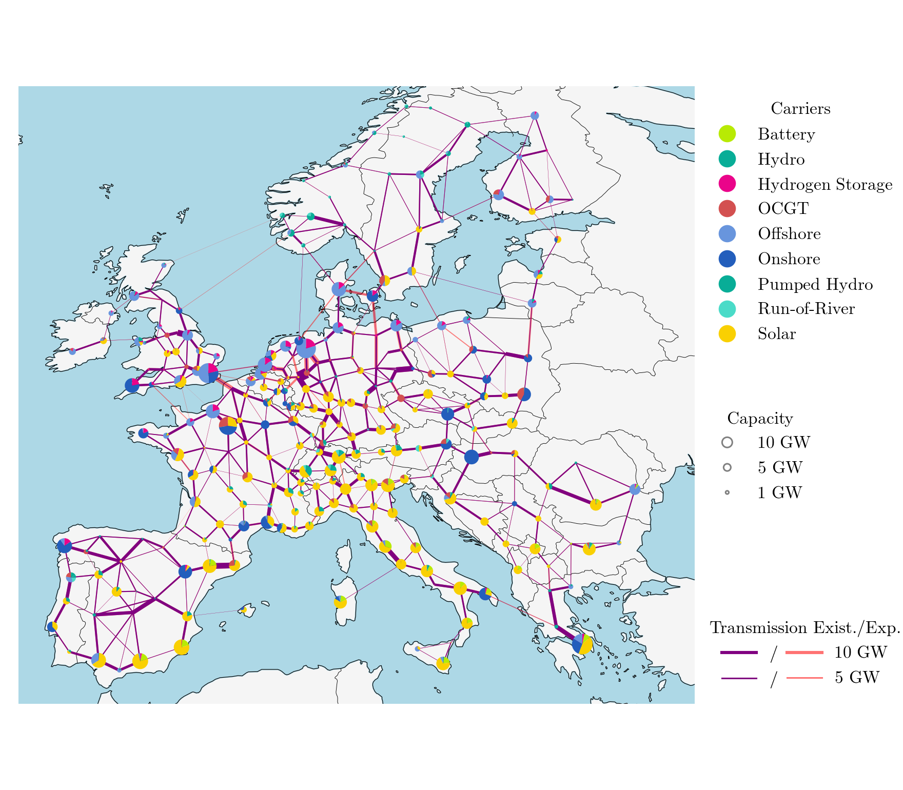
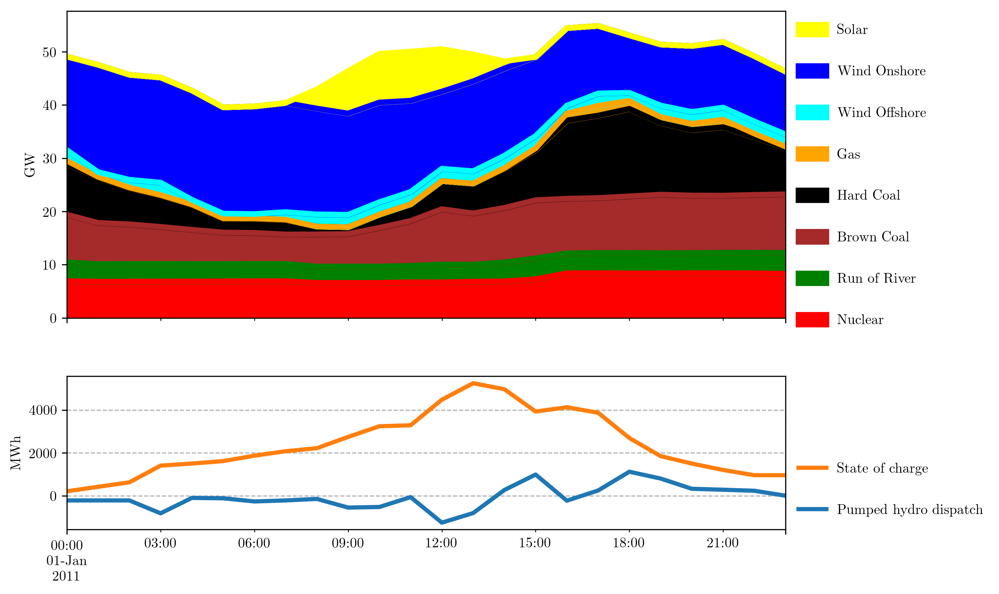
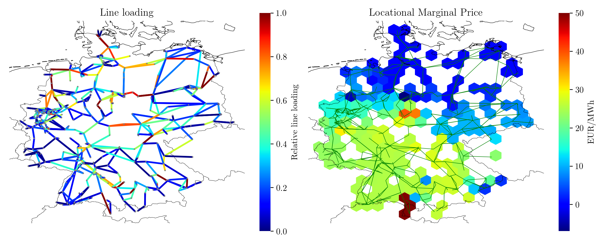
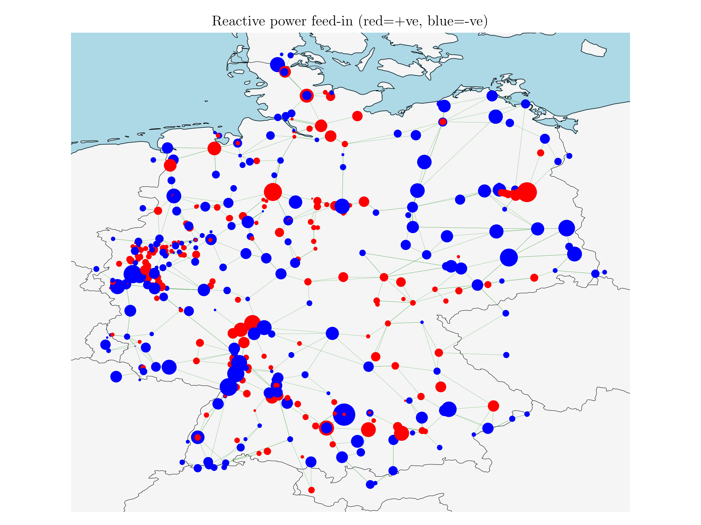
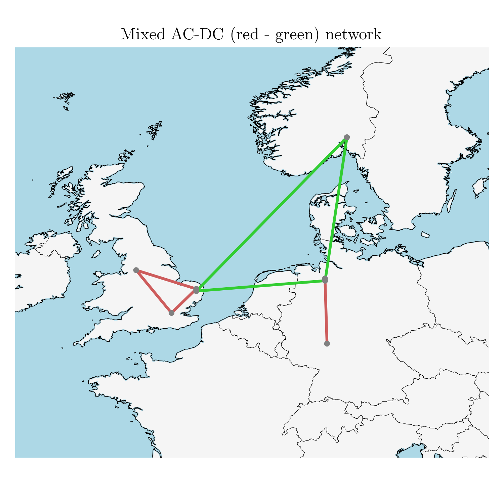

# Features

[Test Link](../user-guide/components.md)

[[faq]]

## Functionality

**PyPSA can calculate:**

* static power flow (using both the full non-linear network equations and
  the linearised network equations)
* linear optimal power flow (least-cost optimisation of power plant and storage
  dispatch within network constraints, using the linear network
  equations, over several snapshots)
* security-constrained linear optimal power flow
* total electricity/energy system least-cost investment optimisation (using linear
  network equations, over several snapshots simultaneously for
  optimisation of generation and storage dispatch and investment in
  the capacities of generation, storage, transmission and other infrastructure)

**It has models for:**

* meshed multiply-connected AC and DC networks, with controllable
  converters between AC and DC networks
* standard types for lines and transformers following the implementation in `pandapower <https://www.pandapower.org>`_
* conventional dispatchable generators and links with unit commitment
* generators with time-varying power availability, such as
  wind and solar generators
* storage units with efficiency losses
* simple hydroelectricity with inflow and spillage
* coupling with other energy carriers
* basic components out of which more complicated assets can be built,
  such as Combined Heat and Power (CHP) units, heat pumps, resistive
  Power-to-Heat (P2H), Power-to-Gas (P2G), battery electric vehicles
  (BEVs), Fischer-Tropsch, direct air capture (DAC), etc.; each of
  these is demonstrated in the `examples
  <https://pypsa.readthedocs.io/en/latest/examples-basic.html>`_

## Target users

PyPSA is intended for researchers, planners and utilities who need a
fast, easy-to-use and transparent tool for power and energy system
analysis. PyPSA is free software and can be arbitrarily extended.

## Screenshots

[PyPSA-Eur](https://github.com/PyPSA/pypsa-eur) optimising capacities of generation, storage and transmission lines (9% line volume expansion allowed) for a 95% reduction in CO2 emissions in Europe compared to 1990 levels:

[SciGRID model](https://power.scigrid.de/) simulating the German power system for 2015. Interactive plots also be generated with the [plotly](https://plot.ly/python/) library, as shown in this [Notebook](https://pypsa.readthedocs.io/en/latest/examples/scigrid-lopf-then-pf.html)
:

Small meshed AC-DC toy model:

