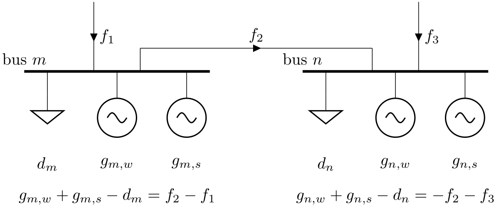

# Bus

The bus is the fundamental node of the network, to which components like loads, generators and transmission lines attach. It enforces energy conservation for all elements feeding in and out of it (i.e. like Kirchhoff's Current Law).

<figure markdown="span">
  { width="600" }
  <figcaption>Buses</figcaption>
</figure>

{{ read_csv('../../../pypsa/data/component_attrs/buses.csv') }}