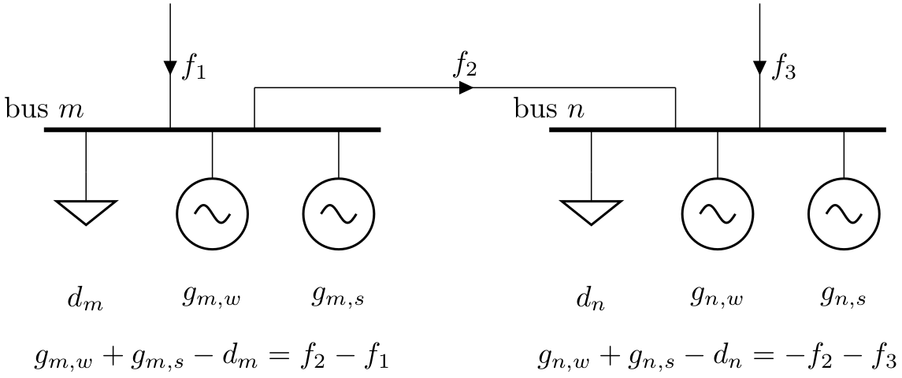

<!--
SPDX-FileCopyrightText: PyPSA Contributors

SPDX-License-Identifier: CC-BY-4.0
-->

# Design

## Network Object

The [`pypsa.Network`][] is an overall container for all network <!-- md:guide 
components.md -->. Components cannot exist without a network and are always 
attached to one. A network also holds functions to run different types of 
optimisation problems, compute power flows, read or write networks to files, 
retrieve statistics and plot the network.

``` py
>>> import pypsa
>>> n = pypsa.Network()
>>> n
Empty PyPSA Network 'Unnamed Network'
-------------------------------
Components: none
Snapshots: 1
<BLANKLINE>
```

!!! tip

    A short name, such as `n`, is recommended since it is used frequently to access the network's components and methods.

## Network Components

PyPSA represents power and energy systems using the following component types:

{{ read_csv('../../pypsa/data/components.csv') }}

Each component has a set of attributes with data types, default values, and
descriptions for each attribute. For instance, attributes for capacity,
efficiency, costs, and the buses to which components are attached. For the
documentation of attributes for each component, see <!-- md:guide components.md -->, which can also be accessed as a
`pandas.DataFrame`, e.g. as
[`n.components.buses.defaults`][pypsa.Components.defaults].

Components are grouped according to their properties in sets such as
[`n.one_port_components`][pypsa.network.components.NetworkComponentsMixin.one_port_components]
(connecting to a single bus),
[`n.branch_components`][pypsa.network.components.NetworkComponentsMixin.branch_components]
(connecting two or more buses),
[`n.passive_branch_components`][pypsa.network.components.NetworkComponentsMixin.passive_branch_components]
(whose power flow is determined passively by impedances and nodal power
imbalances), and
[`n.controllable_branch_components`][pypsa.network.components.NetworkComponentsMixin.controllable_branch_components]
(whose power flow can be controlled by the optimisation).

## Buses

The [`Bus`][pypsa.components.Buses] is the fundamental node of the network, to which all other components
attach. It enforces conservation of flows for all elements feeding in and out of
it in any time step. A [`Bus`][pypsa.components.Buses] can represent a power substation, but it can also
be used for other, non-electric energy carriers (e.g. hydrogen, heat, oil) or
even non-energy carriers (e.g. CO~2~ or steel) in different locations.

``` py
>>> n.add("Bus", "my_bus")
```

<figure markdown="span">
  { width="600" }
</figure>

## Energy Balances

- Energy **enters** the model via [`Generator`][pypsa.components.Generators] components, [`Load`][pypsa.components.Loads] components with
  negative sign, and [`StorageUnit`][pypsa.components.StorageUnits] or [`Store`][pypsa.components.Stores] components with higher energy
  levels in the first than in the last time step, and any components with
  efficiency values greater than 1 (e.g. heat pumps).

- Energy **leaves** the model via [`Load`][pypsa.components.Loads] components, [`Generator`][pypsa.components.Generators] components with
  negative sign, [`StorageUnit`][pypsa.components.StorageUnits] or [`Store`][pypsa.components.Stores] components with higher energy in the
  last then in the first time step, and in [`Link`][pypsa.components.Links], [`Line`][pypsa.components.Lines] and [`StorageUnit`][pypsa.components.StorageUnits]
  components with efficiency less than 1.

## Snapshots

Snapshots represent the time steps of the network, and are stored as
`pandas.Index` or `pandas.MultiIndex`. Snapshots are used to represent the
time-varying nature of the network, such as the availability of renewable energy
sources, the demand for electricity, or the state of charge of storage units.
All time-dependent series quantities are indexed by
[`n.snapshots`][pypsa.network.index.NetworkIndexMixin.snapshots]. Networks
default to a single snapshot called "now" and can be set with
[`n.set_snapshots()`][pypsa.Network.set_snapshots].


``` py
>>> n.set_snapshots([0, 1, 2])
>>> n.snapshots
Index([0, 1, 2], dtype='int64', name='snapshot')
```

!!! note

    For many applications, snapshots represent time intervals and are commonly defined as a `pandas.DatetimeIndex`, for example using `pd.date_range("2024-01-01", periods=168, freq="H")` to create hourly intervals for a week.

Snapshot weightings are applied to each snapshot, so that snapshots can
represent more than one hour or fractions of one hour. Three different
categories of snapshot weightings can be set. Objective weightings are used to
weight snapshots in the objective function. Store weightings determine the state
of charge change for stores and storage units. The generator weightings are used
when calculating global constraints and energy balances. Snapshot weightings are
stored as a `pandas.DataFrame` and indexed by [`n.snapshots`][pypsa.network.index.NetworkIndexMixin.snapshots]. They default to a
uniform snapshot weighting of 1 hour.

``` py
>>> n.snapshot_weightings
          objective  stores  generators
snapshot
0               1.0     1.0         1.0
1               1.0     1.0         1.0
2               1.0     1.0         1.0
```

## Investment Periods

For long-term planning problems where the network is optimised for different
time horizons, it is possible to define multiple investment periods (e.g. 2025,
2035, 2045). Investment periods can be defined in
[`n.investment_periods`][pypsa.network.index.NetworkIndexMixin.investment_periods],
a `pandas.Index` of monotonically increasing integers of years, with
[`n.set_investment_periods()`][pypsa.Network.set_investment_periods].

``` py
>>> n.set_investment_periods([2025, 2035, 2045])
>>> n.investment_periods
Index([2025, 2035, 2045], dtype='int64', name='period')
```

By default, there are no investment periods defined, and the network is
optimised for a single investment period (overnight scenario).

Just like snapshots, investment periods can have weightings. These are defined
in
[`n.investment_period_weightings`][pypsa.network.index.NetworkIndexMixin.investment_period_weightings],
which is a `pandas.DataFrame` indexed by
[`n.investment_periods`][pypsa.network.index.NetworkIndexMixin.investment_periods]
with two columns: "objective" and "years". Objective weightings are multiplied
with all cost coefficients in the objective function of the respective
investment period (e.g. for including a social discount rate). Years weightings
denote the elapsed time until the subsequent investment period (e.g. for global
constraints on emissions). They default to a uniform weighting of 1 for each
investment period.

``` py
>>> n.investment_period_weightings
        objective  years
period
2025          1.0    1.0
2035          1.0    1.0
2045          1.0    1.0
```

!!! note

    When investment periods are used, [`n.snapshots`][pypsa.network.index.NetworkIndexMixin.snapshots] becomes a `pandas.MultiIndex`
    with two index levels: a first level for the investment periods and a second
    level for the time steps. As [`n.snapshot_weightings`][pypsa.network.index.NetworkIndexMixin.snapshot_weightings] is indexed by
    [`n.snapshots`][pypsa.network.index.NetworkIndexMixin.snapshots], its index is then also a `pandas.MultiIndex`. It is possible to have different snapshots
    for each investment period, since users may want a higher resolution
    in later years where there are more renewables, and the weather may change due to climate change.

!!! example "Example: Applying a social discount rate to investment period objective weightings"

    To apply a social discount rate to the objective weightings of investment
    periods, consider that each investment period $a$ is associated with a set of
    years $y \in Y_a$ over which costs occur.

    The discount factor $d_y$ adjusts costs from year $y$ to the base currency year $y_0$ using a social discount rate $r$:

    $$d_y = \frac{1}{(1 + r)^{y - y_0}}$$

    The total discounted weight $v_a^o$ for investment period $a$ is the sum of discounted factors over all years $y \in Y_a$:

    $$v_a^o = \sum_{y \in Y_a} d_y$$

    For example, let $r = 0.02$, $y_0 = 2025$, and investment period $a = 2030$ with $Y_{2030} = \{2030, 2031, 2032, 2033, 2034\}$. Then:

    $$v_{2030}^o = \sum_{y=2030}^{2034} \frac{1}{(1 + 0.02)^{y - 2025}} \approx 4.355$$

    The year weighting $v_a^y = 5$ would remain, as it represents the number of years in the investment period.

## Scenarios

By default, the network is optimised for a single deterministic scenario
([`n.has_scenarios`][pypsa.Network.has_scenarios] is `False`). If scenarios are defined, the network is
optimised for multiple scenarios in form of a risk-neutral two-stage stochastic programming
framework (see <!-- md:guide optimization/stochastic.md --> and [:material-book: Stochastic Programming Example](../examples/stochastic-optimization.ipynb)).

Scenario names are stored in `n.scenarios`, a `pandas.DataFrame`, and are set
with [`n.set_scenarios()`][pypsa.Network.set_scenarios].

``` py
>>> n = pypsa.Network() # docs-hide
>>> n.set_scenarios(["low", "high"])
>>> n.scenarios
Index(['low', 'high'], dtype='object', name='scenario')
```

Probabilities for each scenario can also be set with
[`n.set_scenarios()`][pypsa.Network.set_scenarios], by passing a dictionary with
scenario names as keys and probabilities as values. The probabilities are stored
in `n.scenario_weightings`, a `pandas.Series` indexed by `n.scenarios`.

``` py
>>> n = pypsa.Network() # docs-hide
>>> n.set_scenarios({"low": 0.7, "high": 0.3})
>>> n.scenario_weightings
          weight
scenario
low          0.7
high         0.3
```

If no probabilities are set, they default to a uniform distribution.

While the default stochastic programming formulation is risk-neutral, a risk-averse
formulation using the Conditional Value at Risk (CVaR) is also supported. Two parameters `omega` and `alpha` control the risk-aversion. `omega` controls the trade-off between the expected costs and the CVaR measure, while `alpha` sets the confidence level for the CVaR measure. Both parameters can be set with [`n.set_risk_preference()`][pypsa.Network.set_risk_preference] and are stored in a dictionary in `n.risk_preference`.

```py
>>> n.set_risk_preference(alpha=0.9, omega=0.5)
>>> n.risk_preference
{'alpha': 0.9, 'omega': 0.5}
```

For more details, see <!-- md:guide optimization/stochastic.md -->.

## Data Storage

For each class of components, the data describing the components is stored in
memory in `pandas.DataFrame` objects. 

**Static data** is stored in a `pandas.DataFrame`, which is an attribute of the
[`pypsa.Network`][], with names that follow the component names. For instance,

``` py
>>> n = pypsa.examples.ac_dc_meshed() # docs-hide
>>> n.buses
            v_nom type      x      y  ... control generator sub_network  country
name                                  ...
London      380.0       -0.13  51.50  ...      PQ                             UK
Norwich     380.0        1.30  52.60  ...      PQ                             UK
Norwich DC  200.0        1.30  52.50  ...      PQ                             UK
Manchester  380.0       -2.20  53.47  ...      PQ                             UK
Bremen      380.0        8.80  53.08  ...      PQ                             DE
Bremen DC   200.0        8.80  52.98  ...      PQ                             DE
Frankfurt   380.0        8.70  50.12  ...      PQ                             DE
Norway      380.0       10.75  60.00  ...      PQ                             NO
Norway DC   200.0       10.75  60.00  ...      PQ                             NO
<BLANKLINE>
[9 rows x 14 columns]
```

In this `pandas.DataFrame`, the index corresponds to the unique
string names of the components, while the columns correspond to the components'
static attributes.

**Time-varying data** is stored in a dictionary of `pandas.DataFrame` objects,
which is an attribute of the [`pypsa.Network`][], with names that follow the
component names with a `_t` suffix. For instance,

``` py
>>> n = pypsa.examples.ac_dc_meshed() # docs-hide
>>> n.buses_t
{'v_mag_pu_set': Empty DataFrame
Columns: []
Index: [2015-01-01 00:00:00, 2015-01-01 01:00:00, 2015-01-01 02:00:00, 2015-01-01 03:00:00, 2015-01-01 04:00:00, 2015-01-01 05:00:00, 2015-01-01 06:00:00, 2015-01-01 07:00:00, 2015-01-01 08:00:00, 2015-01-01 09:00:00], 'p': Empty DataFrame
Columns: []
Index: [2015-01-01 00:00:00, 2015-01-01 01:00:00, 2015-01-01 02:00:00, 2015-01-01 03:00:00, 2015-01-01 04:00:00, 2015-01-01 05:00:00, 2015-01-01 06:00:00, 2015-01-01 07:00:00, 2015-01-01 08:00:00, 2015-01-01 09:00:00], 'q': Empty DataFrame
Columns: []
Index: [2015-01-01 00:00:00, 2015-01-01 01:00:00, 2015-01-01 02:00:00, 2015-01-01 03:00:00, 2015-01-01 04:00:00, 2015-01-01 05:00:00, 2015-01-01 06:00:00, 2015-01-01 07:00:00, 2015-01-01 08:00:00, 2015-01-01 09:00:00], 'v_mag_pu': Empty DataFrame
Columns: []
Index: [2015-01-01 00:00:00, 2015-01-01 01:00:00, 2015-01-01 02:00:00, 2015-01-01 03:00:00, 2015-01-01 04:00:00, 2015-01-01 05:00:00, 2015-01-01 06:00:00, 2015-01-01 07:00:00, 2015-01-01 08:00:00, 2015-01-01 09:00:00], 'v_ang': Empty DataFrame
Columns: []
Index: [2015-01-01 00:00:00, 2015-01-01 01:00:00, 2015-01-01 02:00:00, 2015-01-01 03:00:00, 2015-01-01 04:00:00, 2015-01-01 05:00:00, 2015-01-01 06:00:00, 2015-01-01 07:00:00, 2015-01-01 08:00:00, 2015-01-01 09:00:00], 'marginal_price': Empty DataFrame
Columns: []
Index: [2015-01-01 00:00:00, 2015-01-01 01:00:00, 2015-01-01 02:00:00, 2015-01-01 03:00:00, 2015-01-01 04:00:00, 2015-01-01 05:00:00, 2015-01-01 06:00:00, 2015-01-01 07:00:00, 2015-01-01 08:00:00, 2015-01-01 09:00:00]}
```

The keys of the dictionary are the names of the component attributes. The index
of the `pandas.DataFrame` corresponds to the snapshots, while the columns
correspond to the component names. For instance, this can be used to represent
the changing availability of variable renewable generators per unit of nominal
capacity (`p_max_pu`):

``` py
>>> n = pypsa.Network() # docs-hide
>>> n.set_snapshots(pd.date_range("2015-01-01", periods=3, freq="h")) # docs-hide
>>> n.add("Bus", "my_bus") # docs-hide
>>> n.add("Generator", "Wind", bus="my_bus", p_nom=10, p_max_pu=[0.1, 0.5, 0.2])
>>> n.generators_t.p_max_pu
name                  Wind
snapshot
2015-01-01 00:00:00    0.1
2015-01-01 01:00:00    0.5
2015-01-01 02:00:00    0.2
```

**Input data**, such as the availability `p_max_pu` of a generator, can be
stored statically in `n.generators` if the value does not change over
`n.snapshots` *or* can be defined in `n.generators_t.p_max_pu`. If the name of
the generator is in the columns of `n.generators_t.p_max_pu`, the static value
in `n.generators` will be ignored.

**Output data** related to the operation of the system, such as the optimised
dispatch `p` of a generator, is always returned as time-varying data
(`n.generators_t.p`). Results related to capacities is stored as static data,
such as the optimised nominal capacity `p_nom` of a generator in
`n.generators.p_nom`.

Attributes that can be time-varying are marked as "series" in the listings in
<!-- md:guide components.md -->.


## Separation of Inputs and Outputs

Input and output data is strictly separated, such that inputs are not
overwritten by outputs. For instance, set points (`p_set`) are stored separately
from actual dispatch points (`p`).

The listings in <!-- md:guide components.md --> show
for each attribute whether it is an input (which the user specifies) or output
(which is computed by PyPSA). Inputs can be either "required" or "optional".
Optional inputs are assigned a sensible default value if the user gives no
input.

## Unit Conventions

The units for physical quantities follow the general rules.

| Quantity | Units |
|----------|-------|
| Power | MW/MVA/MVar (unless per unit of nominal power, e.g. `n.generators.p_max_pu` for variable generators is per-unit of `n.generators.p_nom`) |
| Time | h |
| Energy | MWh |
| Voltage | kV phase-phase for `n.buses.v_nom`; per-unit for `n.buses.v_mag_pu` |
| Angles | radians, except `n.transformers.phase_shift` which is in degrees |
| Impedance | Ohm, except transformers which are per-unit, using `n.transformers.s_nom` for the base power |
| CO~2~ emissions | tonnes of CO~2~ per MWh~thermal~ of energy carrier |

Per unit values of voltage and impedance are used internally for
network calculations. It is assumed that the base power is
**1 MVA**. The base voltage depends on the component.

!!! note

    The units of buses can also refer to non-electric carriers, such as tonnes of hydrogen (t~H2~). In this case, the units
    of energy would be t~H2~ with units of power of t~H2~/h. Unit conversions are not applied automatically handled, but must be encoded through the efficiencies.

## Variable Conventions

All nominal capacities and dispatch variables refer to `bus` for one-port components and `bus0` for branch components. 

## Sign Conventions

* The power (`p`,`q`) of generators or storage units is positive if the
  asset is injecting power into the bus, and negative if withdrawing power
  from bus.
* The power (`p`,`q`) of loads is positive if withdrawing power from bus,
  negative if injecting power into bus.
* The power (`p0`,`q0`) at `bus0` of a branch (line, link, or transformer) is
  positive if the branch is
  withdrawing power from `bus0`, i.e. `bus0` is injecting into the branch.
* Similarly the power (`p1`,`q1`) at `bus1` of a branch is positive if the
  branch is withdrawing power from `bus1`, and negative if the branch is
  injecting into `bus1`.
* If `p0>0` and `p1<0` for a branch then power flows from `bus0`
  to `bus1`; `p0+p1 > 0` is the loss for this direction of flow.

