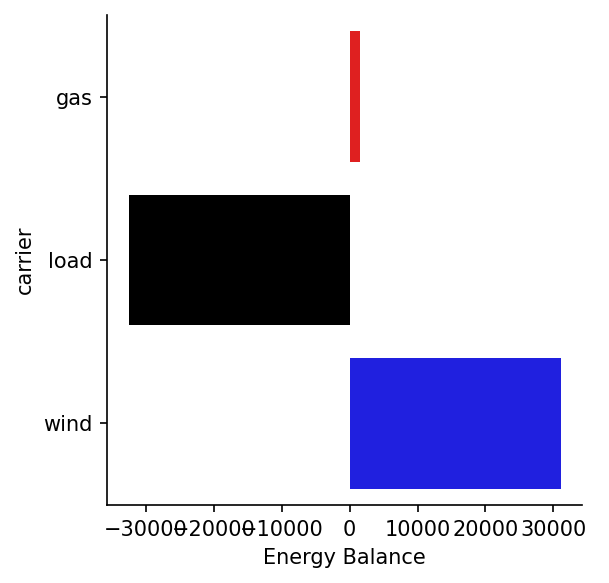
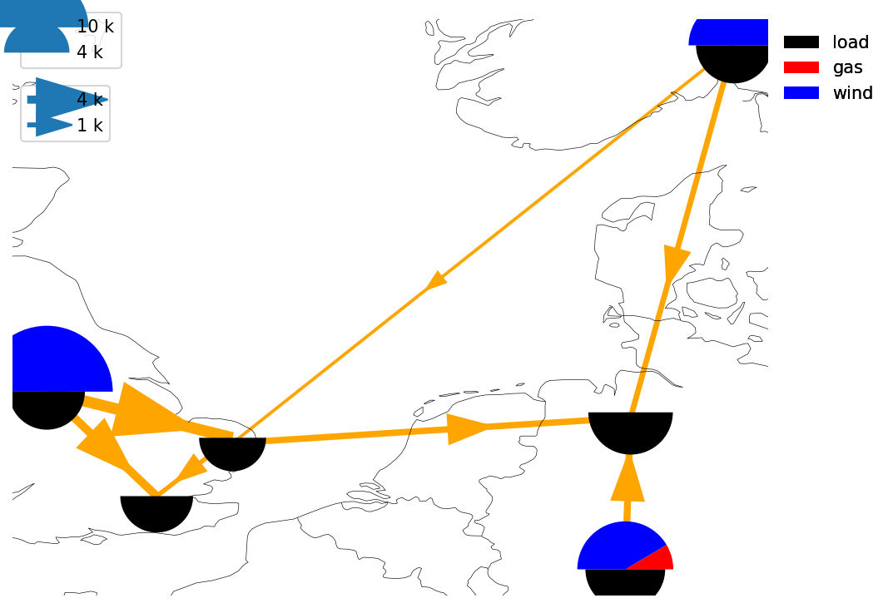
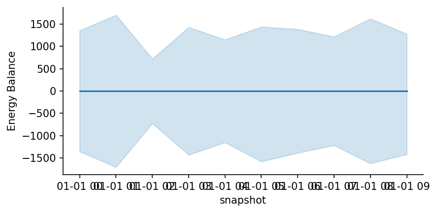
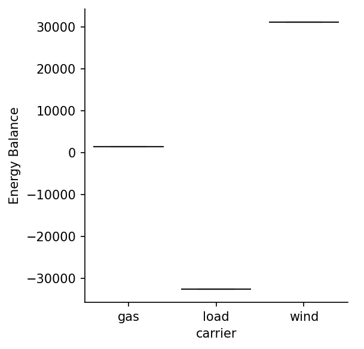
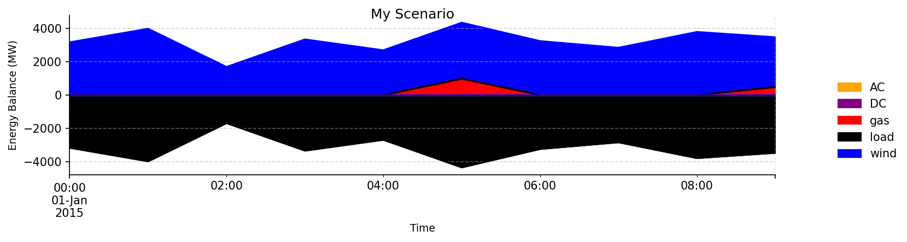

<!--
SPDX-FileCopyrightText: PyPSA Contributors

SPDX-License-Identifier: CC-BY-4.0
-->

# Statistics

PyPSA offers a variety of functions for plotting networks based on the statistics module. Line, bar and area charts can be plotted against any network metric, and plots can be created as either as static `matplotlib` figures or interactive `plotly` charts.


## Static Plots
Various key metrics that can be calculated on any PyPSA network are described in the <!-- md:guide statistics.md --> section. The plotting module lets you create plots of any of these metrics.

!!! info

    The examples below are based on two networks: `n_simple` is based on a minimal three-node network, which is available via [pypsa.examples.ac_dc_meshed][], and `n` is the more complex hybrid scenario network from a recently published paper on carbon management. This network is also available in PyPSA via [pypsa.examples.carbon_management][].
    
    Load the networks:
    
    === "Simple Network"
        ``` py
        # Simple three-node network 
        >>> n_simple = pypsa.examples.ac_dc_meshed()
        >>> n_simple # doctest: +SKIP
        PyPSA Network 'AC-DC-Meshed'
        ----------------------------
        Components:
         - Bus: 9
         - Carrier: 6
         - Generator: 6
         - GlobalConstraint: 1
         - Line: 7
         - Link: 4
         - Load: 6
        Snapshots: 10
        <BLANKLINE>
        ```
    
    === "Complex Network"
        ``` py
        # Complex sector coupled network
        >>> n = pypsa.examples.carbon_management()
        >>> n # doctest: +SKIP
        PyPSA Network 'Hybrid Scenario from https://www.nature.com/articles/s41560-025-01752-6'
        ---------------------------------------------------------------------------------------
        Components:
         - Bus: 2164
         - Carrier: 89
         - Generator: 1489
         - GlobalConstraint: 4
         - Line: 157
         - Link: 6830
         - Load: 1357
         - StorageUnit: 106
         - Store: 1263
        Snapshots: 168
        <BLANKLINE>
        ```


### Defaults

Many different statistics are available via the [`n.statistics`][pypsa.Network.statistics] accessor:

``` py
>>> n_simple.statistics.energy_balance()
component  carrier  bus_carrier
Generator  gas      AC              1465.27439
           wind     AC             31082.35370
Load       load     AC            -32547.62808
dtype: float64
```

Any of these metrics can also be used to create plots straight away:

``` py
>>> n_simple.statistics.energy_balance.plot()  # doctest: +SKIP
```
<figure markdown="span">
  { width="600" }
</figure>

The default plot type varies depending on which type typically makes the most sense for a given metric. For instance, `n.statistics.energy_balance.plot()` produces an area plot with snapshots on the x-axis, whereas `n.statistics.installed_capacity.plot()` produces a simple bar chart without a time dimension.

``` py
>>> n_simple.statistics.installed_capacity.plot()  # doctest: +SKIP
```
<figure markdown="span">
  { width="350" }
</figure>

#### Complex Networks
In principle, these standard plots can be created from any network. However, depending on factors such as network size, number of components and snapshots, the plot may be difficult to read and may require further customisation. If the default option is not useful, there are three options to get useful plots for more complex networks:

1. The full static plot API is also available for interactive plots. This gives you more control over data selection and data can be more easily explored. See [Interactive Plots](#interactive-plots).
2. Plots are created using [matplotlib](https://matplotlib.org/) and [seaborn](https://seaborn.pydata.org/). This means that you can use all the customization options of these libraries to further customize the plot. See [Customization with matplotlib and seaborn](#customization).
3. The parameters that can be used to filter and aggregate data using base statistics methods can also be passed to plotting methods. See [Customization based on statistics parameters](#customization).

All options are described in the following sections.

### Plot Types
The basic plotting method ([`n.statistics.<metric>.plot()`][pypsa.Network]) is not very flexible, but useful for quick exploration. To gain more control over the plot, the according plot type method can be called directly. Any plot type can be used with any metric, although not all plots will be meaningful for all metrics.

For instance, energy balances can also be shown as a bar chart, ignoring the time dimension:
``` py
>>> n_simple.statistics.energy_balance.plot.bar()  # doctest: +SKIP
```
<figure markdown="span">
  { width="350" }
</figure>


#### Available Plot Types
The following plot types are available:

- [Area Plot][pypsa.Network]
- [Bar Plot][pypsa.Network]
- [Map Plot][pypsa.Network]
- [Scatter Plot][pypsa.Network]
- [Line Plot][pypsa.Network]
- [Box Plot][pypsa.Network]
- [Violin Plot][pypsa.Network]
- [Histogram Plot][pypsa.Network]

=== "Area Plot"
    ``` py
    >>> n_simple.statistics.energy_balance.plot.area()  # doctest: +SKIP
    ```
    <figure markdown="span">
      { width="600" }
    </figure>

=== "Bar Plot"
    ``` py
    >>> n_simple.statistics.energy_balance.plot.bar()  # doctest: +SKIP
    ```
    <figure markdown="span">
      { width="350" }
    </figure>

=== "Map Plot"
    ``` py
    >>> n_simple.statistics.energy_balance.plot.map()  # doctest: +SKIP
    ```
    <figure markdown="span">
      { width="600" }
    </figure>

=== "Scatter Plot"
    ``` py
    >>> n_simple.statistics.energy_balance.plot.scatter()  # doctest: +SKIP
    ```
    <figure markdown="span">
      { width="350" }
    </figure>

=== "Line Plot"
    ``` py
    >>> n_simple.statistics.energy_balance.plot.line()  # doctest: +SKIP
    ```
    <figure markdown="span">
      { width="600" }
    </figure>

=== "Box Plot"
    ``` py
    >>> n_simple.statistics.energy_balance.plot.box()  # doctest: +SKIP
    ```
    <figure markdown="span">
      { width="350" }
    </figure>

=== "Violin Plot"
    ``` py
    >>> n_simple.statistics.energy_balance.plot.violin()  # doctest: +SKIP
    ```
    <figure markdown="span">
      { width="350" }
    </figure>

=== "Histogram Plot"
    ``` py
    >>> n_simple.statistics.energy_balance.plot.histogram()  # doctest: +SKIP
    ```
    <figure markdown="span">
      { width="350" }
    </figure>


### Customization
#### Customization with matplotlib and seaborn
All plot methods return a `matplotlib` figure object, a `matplotlib` axes object and a facet grid object. These can be used to customise the plot further. See the matplotlib documentation on [`matplotlib.figure`](https://matplotlib.org/stable/api/figure_api.html), [`matplotlib.axes`](https://matplotlib.org/stable/api/axes_api.html) and the seaborn documentation on [`seaborn.FacetGrid`](https://seaborn.pydata.org/generated/seaborn.FacetGrid.html).

``` py
>>> fig, ax, facet_col = n_simple.statistics.energy_balance.plot.area()
>>> fig.set_size_inches(12, 3)
>>> fig.suptitle("My Scenario", fontsize=12)
>>> ax.grid(True, alpha=0.5, linestyle="--")
>>> ax.set_xlabel("Time", fontsize=9)
>>> ax.set_ylabel("Energy Balance (MW)", fontsize=9)
```
<figure markdown="span">
  { width="800" }
</figure>

#### Customization with statistics parameters
Parameters which are available in the statistics methods to filter and aggregate data can also be passed to the corresponding plotting methods. The full energy balance of the carbon management example network yields too many different `carriers` to be shown in a single plot. However, if we filter it down to include only buses with the 'AC' carrier, via the `bus_carrier` parameter from the statistics method, we can produce a meaningful plot.

=== "Buses with AC carrier"

    ``` py
    >>> n.statistics.energy_balance.plot.area(bus_carrier="AC", figsize=(12, 3))  # doctest: +SKIP
    ```
    <figure markdown="span">
    { width="800" }
    </figure>

=== "All Buses"

    ``` py
    >>> n.statistics.energy_balance.plot.area(figsize=(10, 3))  # doctest: +SKIP
    ```
    <figure markdown="span">
    { width="800" }
    </figure>


Behind the scenes, each plotting method selects a different set of parameters to call the relevant statistics method. Therefore, the default value can be different for each plot type and metric. Most of these parameters can also be passed directly to the plotting method. Please refer to the <!-- md:guide statistics.md --> for more details.

!!! tip

    To decide which subset of data to show in your plot, it is often helpful to experiment with the relevant statistics method first to find the right parameters. Once you are happy with your selection, simply pass the parameters to the plotting method and the same selection will be applied. You can also pass them alongside all the other available plotting parameters. Check the API reference for details.


## Interactive Plots

All the logic for static plots, using `n.statistics.<metric>.plot.<plot_type>()`, is mirrored for interactive plots. While the returned object and parameters may differ, you can usually simply replace `plot` with `iplot` to get an interactive version of the same plot. Behind the scenes, [Plotly](https://plotly.com/python/) is used for the interactive plots and the returned object is a Plotly figure object. Check out the [Plotly documentation](https://plotly.com/python-api-reference/generated/plotly.graph_objects.Figure.html) for more details.

### Examples

#### Simple Energy Balance Area Plot

=== "Interactive Version"

    ``` py
    >>> n_simple.statistics.energy_balance.iplot.area()  # doctest: +SKIP
    ```
    
    <div style="width: 100%; height: 500px;">
        <iframe src="../../../assets/interactive/ac_dc_meshed-energy_balance-area_iplot.html" 
                width="100%" height="100%" frameborder="0" style="border: 0px solid #ccc;">
        </iframe>
    </div>

=== "Static Plot"

    ``` py
    >>> n_simple.statistics.energy_balance.plot()  # doctest: +SKIP
    ```
    <figure markdown="span">
    { width="600" }
    </figure>

#### Carbon Network Energy Balance with bus carrier `AC`

=== "Interactive Version"

    ``` py
    >>> n.statistics.energy_balance.iplot.area(bus_carrier="AC")  # doctest: +SKIP
    ```
    
    <div style="width: 100%; height: 500px;">
        <iframe src="../../../assets/interactive/carbon_management-energy_balance-area_iplot-AC-bus_carrier.html" 
                width="100%" height="100%" frameborder="0" style="border: 0px solid #ccc;">
        </iframe>
    </div>

=== "Static Plot"

    ``` py
    >>> n.statistics.energy_balance.plot(bus_carrier="AC")  # doctest: +SKIP
    ```
    <figure markdown="span">
    { width="800" }
    </figure>


#### Full Carbon Network Energy Balance

=== "Interactive Version"

    ``` py
    >>> n.statistics.energy_balance.iplot.area()  # doctest: +SKIP
    ```
    <div style="width: 100%; height: 500px;">
        <iframe src="../../../assets/interactive/carbon_management-energy_balance-area_iplot.html" 
                width="100%" height="100%" frameborder="0" style="border: 0px solid #ccc;">
        </iframe>
    </div>

=== "Static Plot"

    ``` py
    >>> n.statistics.energy_balance.plot.area(figsize=(10, 3))  # doctest: +SKIP
    ```
    <figure markdown="span">
    { width="800" }
    </figure>


<!-- ## Plotting based on network data

Any plotting functionality is optional and only extend the existing statistics module to simplify the creation of plots. All data in PyPSA is  -->

<!-- Here, we are going to import a network and plot the electricity flow:

``` py
import warnings

import cartopy.crs as ccrs
import matplotlib.pyplot as plt
import pandas as pd
from shapely.errors import ShapelyDeprecationWarning

import pypsa

warnings.filterwarnings("ignore", category=ShapelyDeprecationWarning)
plt.rc("figure", figsize=(10, 8))
```

#### Import and optimize a network

``` py
n = pypsa.examples.ac_dc_meshed(from_master=True)
n.optimize()
```

Get mean generator power by bus and carrier:

``` py
gen = n.generators.assign(g=n.generators_t.p.mean()).groupby(["bus", "carrier"]).g.sum()
```

Plot the electricity flows:

``` py
# links are not displayed for prettier output ('link_width=0')
n.plot(
    bus_size=gen / 5e3,
    bus_color={"gas": "indianred", "wind": "midnightblue"},
    margin=0.5,
    line_width=0.1,
    line_flow="mean",
    link_width=0,
)
plt.show()
```

Plot the electricity flows with a different projection and a colored map:

``` py
# links are not displayed for prettier output ('link_width=0')
n.plot(
    bus_size=gen / 5e3,
    bus_color={"gas": "indianred", "wind": "midnightblue"},
    margin=0.5,
    line_width=0.1,
    line_flow="mean",
    link_width=0,
    projection=ccrs.EqualEarth(),
    color_geomap=True,
)
plt.show()
```

Set arbitrary values as flow argument using a specific level from the `n.branches()` MultiIndex:

``` py
line_flow = pd.Series(10, index=n.branches().loc["Line"].index)
link_flow = pd.Series(10, index=n.branches().loc["Link"].index)
```

``` py
line_flow
```

``` py
# links are not displayed for prettier output ('link_width=0')
n.plot(
    bus_size=gen / 5e3,
    bus_color={"gas": "indianred", "wind": "midnightblue"},
    margin=0.5,
    line_flow=line_flow,
    link_flow=link_flow,
    line_width=2.7,
    link_width=0,
    projection=ccrs.EqualEarth(),
    color_geomap=True,
)
plt.show()
```

Adjust link colors according to their mean load:

``` py
# Pandas series with MultiIndex
# links are not displayed for prettier output ('link_width=0')
collections = n.plot(
    bus_size=gen / 5e3,
    bus_color={"gas": "indianred", "wind": "midnightblue"},
    margin=0.5,
    line_flow=line_flow,
    line_width=2.7,
    link_width=0,
    projection=ccrs.EqualEarth(),
    color_geomap=True,
    line_color=n.lines_t.p0.mean().abs(),
)

plt.colorbar(
    collections["branches"]["Line"], fraction=0.04, pad=0.004, label="Flow in MW"
)
plt.show()
```  -->