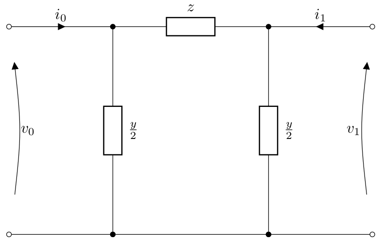
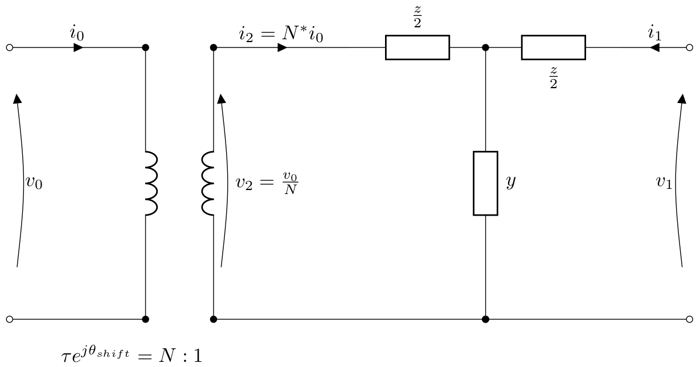
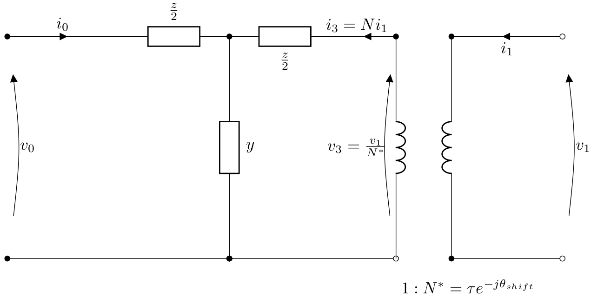
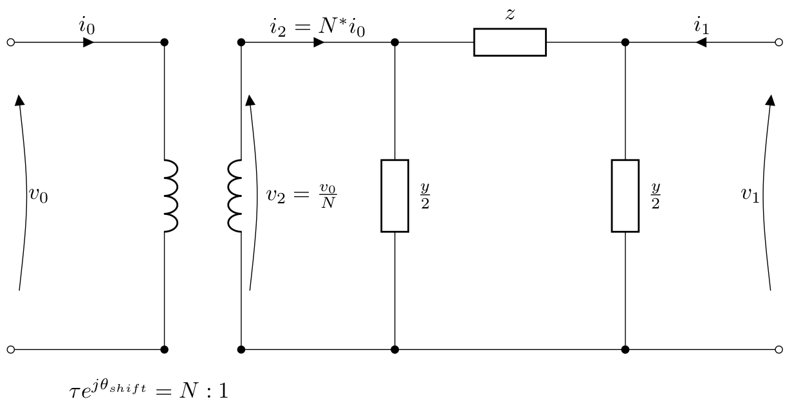
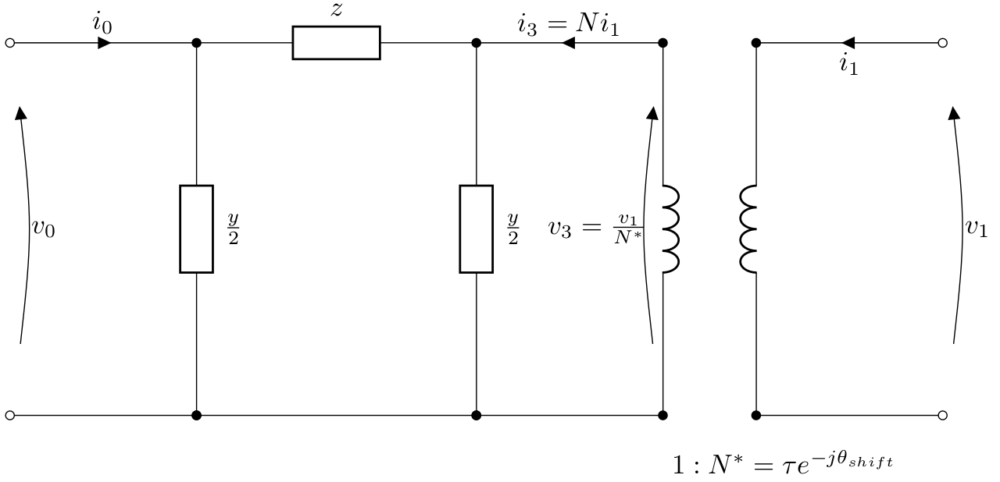

# Non-linear Power Flow

The non-linear power flow calculation [`n.pf()`][pypsa.Network.pf] works for AC
networks and by extension for DC networks, too. It can be called for a
particular snapshot as `n.pf(snapshots=n.snapshots[0])` or on an iterable of
snapshots as `n.pf(snapshots=n.snapshots[:24])`.

The power flow calculation is independent of the optimisation. A common workflow
is to first optimise the network with the linearised approximations of
[`n.optimize()`][pypsa.optimization.OptimizationAccessor.__call__] and then to run the non-linear power
flow calculation on the optimised network with [`n.pf()`][pypsa.Network.pf] for
validation, using the power imbalances from the optimisation as setpoints. There
is a function that does this for you,
[`n.optimize.optimize_and_run_non_linear_powerflow()`][pypsa.optimization.OptimizationAccessor.optimize_and_run_non_linear_powerflow].

## AC networks (single slack)

The power flow ensures for given inputs (load and power plant dispatch) that the following equation is satisfied for each bus $i$:

$$S_i = P_i + j Q_i = V_i I_i^* = V_i \left(\sum_j Y_{ij} V_j\right)^*$$

where $V_i = |V_i|e^{j\theta_i}$ is the complex voltage, whose rotating angle is taken relative to the slack bus.

$Y_{ij}$ is the bus admittance matrix, based on the branch impedances and any shunt admittances attached to the buses.

For the slack bus $i=0$ it is assumed $|V_0|$ is given and that $\theta_0 = 0$; $P$ and $Q$ are to be found.

For the PV buses, $P$ and $|V|$ are given; $Q$ and $\theta$ are to be found.

For the PQ buses, $P$ and $Q$ are given; $|V|$ and $\theta$ are to be found.

If PV and PQ are the sets of buses, then there are $|PV| + 2|PQ|$ real equations to solve:

$$\textrm{Re}\left[ V_i \left(\sum_j Y_{ij} V_j\right)^* \right] - P_i = 0 \hspace{.7cm}\forall\hspace{.1cm} i \in PV \cup PQ$$

$$\textrm{Im}\left[ V_i \left(\sum_j Y_{ij} V_j\right)^* \right] - Q_i = 0 \hspace{.7cm}\forall\hspace{.1cm} i \in PQ$$

To be found: $\theta_i \forall i \in PV \cup PQ$ and $|V_i| \forall i \in PQ$.

These equations $f(x) = 0$ are solved using the [Newton-Raphson method](https://en.wikipedia.org/wiki/Newton%27s_method#k_variables.2C_k_functions), with the Jacobian:

$$\frac{\partial f}{\partial x} = \left( \begin{array}{cc}
\frac{\partial P}{\partial \theta} & \frac{\partial P}{\partial |V|} \\
\frac{\partial Q}{\partial \theta} & \frac{\partial Q}{\partial |V|}
\end{array} \right)$$

and the initial flat guess of $\theta_i = 0$ and $|V_i| = 1$ for unknown quantities.

## AC networks (distributed slack)

If the slack is to be distributed to all generators in proportion to their
dispatch with `n.pf(distribute_slack=True)`, instead of being allocated fully to
the slack bus, the active power balance is altered to

$$\textrm{Re}\left[ V_i \left(\sum_j Y_{ij} V_j\right)^* \right] - P_i - P_{slack}\gamma_i = 0 \hspace{.7cm}\forall\hspace{.1cm} i \in PV \cup PQ \cup slack$$

where $P_{slack}$ is the total slack power and $\gamma_{i}$ is the share of bus $i$ of the total generation that is used to distribute the slack power. Note that also an additional active power balance is included for the slack bus since it is now part of the distribution scheme.

This adds an additional row to the Jacobian for the derivatives of the slack bus active power balance and an additional column for the partial derivatives with respect to $\gamma_i$.

## DC networks

For meshed DC networks the equations are a special case of those for AC networks, with the difference that all quantities are real.

To solve the non-linear equations for a DC network, ensure that the series reactance $x$ and shunt susceptance $b$ are zero for all branches, pick a slack bus (where $V_0 = 1$) and set all other buses to be 'PQ' buses. Then execute [`n.pf()`][pypsa.Network.pf].

The voltage magnitudes then satisfy at each bus $i$:

$$P_i  = V_i I_i = V_i \sum_j G_{ij} V_j$$

where all quantities are real.

$G_{ij}$ is based only on the branch resistances and any shunt conductances attached to the buses.

## Line model

Lines are modelled with the standard equivalent PI model.

If the series impedance is given by

$$z = r+jx$$

and the shunt admittance is given by

$$y = g + jb$$

then the currents and voltages at buses 0 and 1 for a line:

<figure markdown="span">
  { width="600" }
  <figcaption>Line equivalent model</figcaption>
</figure>

are related by

$$\left( \begin{array}{c}
i_0 \\ i_1
\end{array}
\right) =   \left( \begin{array}{cc} \frac{1}{z} + \frac{y}{2} &      -\frac{1}{z}  \\
-\frac{1}{z} & \frac{1}{z} + \frac{y}{2}
\end{array}
\right)  \left( \begin{array}{c}
v_0 \\ v_1
\end{array}
\right)$$

## Transformer model

The transformer models here are largely based on the implementation in [pandapower](https://github.com/panda-power/pandapower), which is loosely based on [DIgSILENT PowerFactory](http://www.digsilent.de/index.php/products-powerfactory.html).

Transformers are modelled either with the equivalent T model (the default, since this represents the physics better) or with the equivalent PI model. The can be controlled by setting transformer attribute `model` to either "t" or "pi".

The tap changer can either be modelled on the primary, high voltage side 0 (the default) or on the secondary, low voltage side 1. This is set with attribute `tap_side`.

If the transformer `type` is not given, then `tap_ratio` is defined by the user, defaulting to `1.`. If the `type` is given, then the user can specify the `tap_position` which results in a `tap ratio` $\tau$ given by:

$$\tau = 1 + (\textrm{tap_position} - \textrm{tap_neutral})\cdot \frac{\textrm{tap_step}}{100}$$

For a transformer with tap ratio $\tau$ on the primary side `tap_side=0` and phase shift $\theta_{\textrm{shift}}$, the equivalent T model is given by:

<figure markdown="span">
  { width="600" }
  <figcaption>Transformer T equivalent model (tap HV)</figcaption>
</figure>

For a transformer with tap ratio $\tau$ on the secondary side `tap_side=1` and phase shift $\theta_{\textrm{shift}}$, the equivalent T model is given by:

<figure markdown="span">
  { width="600" }
  <figcaption>Transformer T equivalent model (tap LV)</figcaption>
</figure>

For the admittance matrix, the T model is transformed into a PI model with the wye-delta transformation.

For a transformer with tap ratio $\tau$ on the primary side `tap_side=0` and phase shift $\theta_{\textrm{shift}}$, the equivalent PI model is given by:

<figure markdown="span">
  { width="600" }
  <figcaption>Transformer PI equivalent model (tap HV)</figcaption>
</figure>

for which the currents and voltages are related by:

$$\left( \begin{array}{c}
i_0 \\ i_1
\end{array}
\right) =   \left( \begin{array}{cc}  \frac{1}{z} + \frac{y}{2} &      -\frac{1}{z}\frac{1}{\tau e^{-j\theta}}  \\
-\frac{1}{z}\frac{1}{\tau e^{j\theta}} & \left(\frac{1}{z} + \frac{y}{2} \right) \frac{1}{\tau^2}
\end{array}
\right)  \left( \begin{array}{c}
v_0 \\ v_1
\end{array}
\right)$$

For a transformer with tap ratio $\tau$ on the secondary side `tap_side=1` and phase shift $\theta_{\textrm{shift}}$, the equivalent PI model is given by:

<figure markdown="span">
  { width="600" }
  <figcaption>Transformer PI equivalent model (tap LV)</figcaption>
</figure>

for which the currents and voltages are related by:

$$\left( \begin{array}{c}
i_0 \\ i_1
\end{array}
\right) =   \left( \begin{array}{cc} \left(\frac{1}{z} + \frac{y}{2} \right) \frac{1}{\tau^2} &      -\frac{1}{z}\frac{1}{\tau e^{-j\theta}}  \\
-\frac{1}{z}\frac{1}{\tau e^{j\theta}} & \frac{1}{z} + \frac{y}{2}
\end{array}
\right)  \left( \begin{array}{c}
v_0 \\ v_1
\end{array}
\right)$$

## Inputs

For the non-linear power flow, the following data for each component are used. For the defaults and units, see [Components](/user-guide/components).

- `n.buses.{v_nom, v_mag_pu_set}`
- `n.loads.{p_set, q_set}`
- `n.generators.{control, p_set, q_set}`
- `n.storage_units.{control, p_set, q_set}`
- `n.stores.{p_set, q_set}`
- `n.shunt_impedances.{b, g}`
- `n.lines.{x, r, b, g}`
- `n.transformers.{x, r, b, g}`
- `n.links.{p_set}`

!!! note

    Note that the control strategy for active and reactive power PQ/PV/Slack is set on the generators not on the buses. Buses then inherit the control strategy from the generators attached at the bus, defaulting to PQ if there is no generator attached. Any PV generator will make the whole bus a PV bus. For PV buses, the voltage magnitude set point is set on the bus, not the generator, with `n.buses.v_mag_pu_set`.

!!! note

    Note that for lines and transformers you **must** make sure that $r+jx$ is non-zero, otherwise the bus admittance matrix will be singular.

## Outputs

- `n.buses.{v_mag_pu, v_ang, p, q}`
- `n.loads.{p, q}`
- `n.generators.{p, q}`
- `n.storage_units.{p, q}`
- `n.stores.{p, q}`
- `n.shunt_impedances.{p, q}`
- `n.lines.{p0, q0, p1, q1}`
- `n.transformers.{p0, q0, p1, q1}`
- `n.links.{p0, p1}`

## Examples

-   :material-notebook:{ .lg .middle } **Newton-Raphson Power Flow**

    ---

    Solves non-linear AC power flow equations using the Newton-Raphson method to inspect voltage magnitudes and angles.

    [:octicons-arrow-right-24: Go to example](../examples/minimal_example_pf.ipynb)

-   :material-notebook:{ .lg .middle } **Transformers**

    ---

    Shows how transformers can be considered with varying tap ratios and phase
    shifts.

    [:octicons-arrow-right-24: Go to example](../examples/transformer_example.ipynb)>

